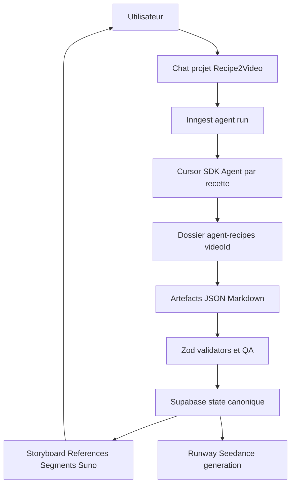

# Plan Agent Recette Cursor SDK

## Objectif
Faire de chaque projet vidéo Recipe2Video une conversation durable avec un agent Cursor SDK dédié à la recette. L’agent maintient les artefacts créatifs dans des fichiers contractuels, l’app les valide/synchronise dans Supabase, puis orchestre références, génération Seedance, review, Suno et assembly.

## Découpage GitHub Issues Et Branches
Je créerai 6 issues GitHub via le MCP GitHub après validation du plan, puis je travaillerai sur une branche dédiée par issue.

- Issue 1 / `agent/cursor-sdk-foundation` : fondation Cursor SDK, contrats d’artefacts et workspace agent.
- Issue 2 / `agent/recipe-agent-data-model` : migrations Supabase, types et repositories pour agent/session/runs/artifacts.
- Issue 3 / `agent/recipe-agent-orchestration` : orchestration Inngest + Cursor SDK + récupération/validation/sync des artefacts.
- Issue 4 / `agent/project-conversation-ux` : chat agent global par projet et adaptation des checkpoints Storyboard/Références/Suno.
- Issue 5 / `agent/seedance-reference-readiness` : rendre les références Seedance centrales et bloquantes avant génération.
- Issue 6 / `agent/legacy-planning-migration` : remplacer progressivement le planning OpenAI figé par l’agent recette, garder fallback/tests/fixtures.

## Architecture Cible



## Contrat Des Artefacts Agent
Chaque agent recette travaille uniquement dans un dossier de workspace logique :

```txt
agent-recipes/{videoId}/
  recipe-analysis.json
  decisions.md
  logical-scenes.json
  seedance-segments.json
  reference-plan.json
  suno-prompt.md
  changelog.md
```

Règles :
- l’agent peut modifier ces fichiers au fil de la conversation ;
- l’app ne synchronise que les artefacts validés ;
- Supabase reste la vérité produit ;
- Git ne sert pas à merger ces fichiers de production quotidienne ;
- seules les évolutions de rules/skills/fixtures peuvent devenir des PRs séparées.

## Flux Produit Cible
1. L’utilisateur crée un projet via l’app.
2. L’app crée un agent Cursor SDK persistant et stocke `cursor_agent_id`.
3. L’agent analyse la recette et écrit `recipe-analysis.json` + `decisions.md`.
4. L’app valide/synchronise et affiche les questions, risques, sous-recettes.
5. L’utilisateur converse avec le même agent pour ajuster intention, hook, durée, style.
6. L’agent produit `logical-scenes.json`.
7. L’app affiche la review storyboard et permet de demander des révisions au même agent.
8. L’agent produit `seedance-segments.json` et `reference-plan.json` ensemble ou dans la même étape.
9. L’app valide que les références sont prêtes pour Seedance : max 9, rôles explicites, cuisine globale, états produit nécessaires.
10. Les références sont approuvées/uploadées vers Runway.
11. L’app génère les segments Seedance avec `promptImage`/`references[]` selon le contrat Runway.
12. En review, le chat segment renvoie les corrections au même agent recette, qui met à jour les prompts/artefacts.
13. L’agent maintient aussi `suno-prompt.md`; l’app garde le workflow Suno manuel + upload audio.

## Issue 1 : Fondation Cursor SDK Et Workspace Agent
Objectif : installer et encapsuler le Cursor SDK sans encore remplacer le pipeline existant.

Fichiers probables :
- `package.json`
- `.env.example`
- `shared/config/*`
- `modules/recipe-agent/*`
- `docs/technical-contracts.md`

Travail :
- Ajouter `@cursor/sdk`.
- Ajouter variables env : `CURSOR_API_KEY`, `CURSOR_AGENT_REPO_URL`, `CURSOR_AGENT_STARTING_REF`, option `CURSOR_AGENT_MODEL`.
- Créer un service `cursor-agent.service.ts` avec : create, resume, send, wait/stream, list/download artifacts, dispose.
- Définir `RecipeAgentWorkspace` et chemins `agent-recipes/{videoId}/...`.
- Définir le prompt système de l’agent recette : travailler uniquement dans le dossier recette, produire artefacts contractuels, ne pas lancer Runway, ne pas modifier le code applicatif.
- Préparer le choix runtime : cloud Cursor par défaut, local seulement pour dev.

Acceptation :
- Service testable avec client mock.
- Aucun appel Cursor réel en test.
- Aucun remplacement du pipeline actuel à ce stade.

## Issue 2 : Modèle De Données Agent
Objectif : persister sessions, runs et artefacts synchronisés.

Fichiers probables :
- `supabase/migrations/*`
- `modules/videos/video.types.ts`
- `modules/recipe-agent/recipe-agent.types.ts`
- `modules/recipe-agent/repositories/*`

Schéma à ajouter :
- colonnes sur `videos` : `cursor_agent_id`, `cursor_agent_runtime`, `agent_workspace_path`, `last_agent_run_id`, `last_agent_sync_at`, `agent_status`.
- table `agent_runs` : `id`, `video_id`, `cursor_agent_id`, `cursor_run_id`, `stage`, `user_message`, `status`, `result_summary`, `error`, timestamps, `created_by`.
- table `agent_artifacts` : `id`, `video_id`, `artifact_name`, `artifact_path`, `content`, `content_hash`, `validation_status`, `validation_errors`, timestamps.

Acceptation :
- Migrations passent.
- Types/repositories couvrent create/read/update.
- Dashboard peut savoir si un agent est idle/running/failed/needs_sync.

## Issue 3 : Orchestration Agent + Sync Artefacts
Objectif : permettre à l’app d’envoyer un message au même agent recette et de synchroniser les fichiers produits.

Fichiers probables :
- `inngest/events.ts`
- `inngest/functions/recipe-agent.ts`
- `modules/recipe-agent/use-cases/*`
- `modules/storyboard/services/planning-output-schemas.ts`
- `modules/storyboard/repositories/*`
- `modules/references/repositories/*`

Travail :
- Ajouter événements Inngest : `recipe.agent.create.requested`, `recipe.agent.message.requested`, `recipe.agent.sync.requested`.
- Implémenter `ensureRecipeAgent(videoId)`.
- Implémenter `sendRecipeAgentMessage(videoId, stage, message)`.
- Télécharger/extraire les artefacts après run.
- Valider : `recipe-analysis.json`, `logical-scenes.json`, `seedance-segments.json`, `reference-plan.json`.
- Synchroniser : recipe data, logical scenes, segments, references, Suno prompt.
- Si validation échoue, stocker erreurs et proposer de renvoyer au même agent un message de correction.

Acceptation :
- Même `cursor_agent_id` réutilisé pour plusieurs messages.
- Les artefacts invalides ne corrompent pas Supabase.
- Les erreurs sont visibles et actionnables.

## Issue 4 : UX Conversationnelle Projet
Objectif : intégrer le chat agent global dans l’expérience produit.

Fichiers probables :
- `modules/videos/ui/*`
- `modules/storyboard/ui/storyboard-review.tsx`
- `modules/feedback/ui/*`
- `modules/recipe-agent/ui/*`
- routes `app/(dashboard)/videos/[videoId]/*`

Travail :
- Ajouter un panneau “Recipe Agent” dans l’overview projet.
- Afficher état agent : idle/running/needs sync/validation failed.
- Ajouter historique de messages/runs agent.
- Ajouter actions rapides par étape : analyser recette, réviser storyboard, générer segments + références, ajuster Suno, corriger segment.
- Adapter `StoryboardReview` pour demander des révisions au même agent.
- Garder `AgentChatPanel` segment mais le relier au même agent recette au lieu d’un prompt diff isolé.
- Afficher “agent draft” vs “approved in app”.

Acceptation :
- L’utilisateur peut itérer naturellement depuis l’app sans repartir de zéro.
- Les checkpoints restent visibles : storyboard approval, references approval, generation launch.
- Aucune génération coûteuse ne démarre depuis un simple message chat.

## Issue 5 : Références Seedance Comme Gate De Génération
Objectif : aligner l’app avec Seedance References mode.

Fichiers probables :
- `modules/references/*`
- `modules/generation/services/runway.service.ts`
- `modules/generation/use-cases/*`
- `modules/storyboard/storyboard.types.ts`
- UI références et segment review

Travail :
- Formaliser `reference-plan.json` : global refs, recipe-specific refs, used-in segments, role, priority, source, status target.
- Mapper références agent vers `reference_assets`.
- Segment ready seulement si références obligatoires approuvées/uploadées.
- UI : compteur `promptImage + references <= 9`, rôle par référence, missing refs, segment blocked state.
- Vérifier Runway : ne jamais mélanger keyframes first/last avec `references[]`.
- S’assurer que `promptImage` + `references[]` reflète le mode image-reference Seedance.
- Générer ou demander les images d’état recette nécessaires avant Seedance : raw/baked/filled/cut/final.

Acceptation :
- Impossible de lancer un segment si références Seedance invalides.
- Les références sont affichées avant génération, pas après.
- Les rôles des références sont visibles et persistés.

## Issue 6 : Migration Du Planning Figé Vers Agent Recette
Objectif : faire de l’agent Cursor SDK le moteur créatif principal tout en gardant fallback/demo.

Fichiers probables :
- `modules/storyboard/services/gpt55-planning-prompt-engine.ts`
- `inngest/functions/planning-stubs.ts`
- `modules/recipe-ingest/ingest-recipe.ts`
- fixtures Paris-Brest
- tests existants

Travail :
- Remplacer le chaînage automatique `ingest -> storyboard OpenAI -> segments` par `create/resume agent -> artifacts -> sync`.
- Garder le planning OpenAI direct en fallback contrôlé ou mode CI/stub.
- Réécrire les tests autour des artefacts agent et validators.
- Mettre à jour demo fixture si nécessaire.
- Supprimer les messages UX qui disent “handled in a later issue” quand ce n’est plus vrai.
- Documenter le flux dans `docs/technical-contracts.md` et `docs/ux-contract.md`.

Acceptation :
- Le chemin principal de création utilise l’agent recette.
- Les fixtures/demo restent disponibles sans Cursor API.
- Le pipeline existant de génération Runway continue à fonctionner avec les segments synchronisés.

## Sécurité Et Garde-Fous
- Toutes les actions agent restent derrière `assertCostlyActionAllowed` ou équivalent.
- `CURSOR_API_KEY` serveur uniquement.
- L’agent ne reçoit pas les secrets Runway/Supabase/Mux sauf nécessité explicite, et dans le plan initial il n’en a pas besoin.
- L’agent ne lance pas Runway ; l’app le fait après validation.
- L’agent ne doit écrire que dans `agent-recipes/{videoId}/`.
- Les artefacts invalides sont stockés comme erreur, jamais appliqués silencieusement.

## Ordre D’Exécution
1. Créer les issues GitHub via MCP avec cette découpe.
2. Branche Issue 1 : fondation SDK et contrat agent.
3. Branche Issue 2 : DB/types/repos.
4. Branche Issue 3 : orchestration + sync minimale.
5. Branche Issue 4 : UX conversationnelle.
6. Branche Issue 5 : références Seedance et génération gates.
7. Branche Issue 6 : migration planning + tests + docs.
8. Passe d’intégration finale : vérifier création recette, révision storyboard, refs, génération Seedance, feedback, Suno.

## Vérification Finale
- Tests unitaires sur services SDK mockés.
- Tests validators artefacts.
- Tests repositories agent.
- Tests génération : blocage si refs invalides, succès si refs valides.
- Démo manuelle : créer Paris-Brest, itérer ouverture, synchroniser segments/références, lancer un segment test, corriger prompt via même agent, générer prompt Suno.