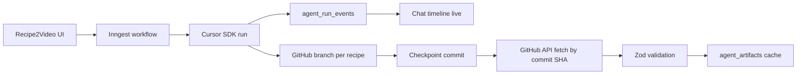

# Plan Agent Live Et Git Checkpoints

## Décision D’architecture

On part sur un flux hybride :

Le stream Cursor devient la source d’observabilité. GitHub devient la source de vérité des fichiers. Supabase garde une copie applicative validée pour l’UI et les workflows suivants.

## Mode De Travail Git

- Créer une nouvelle branche dédiée avant toute implémentation du plan, distincte de la branche de checkpoint existante.
- Travailler et tester localement sur cette branche jusqu’à validation utilisateur du comportement.
- Après validation utilisateur, faire un commit final propre puis créer une PR.
- Ne pas mélanger dans cette PR les artefacts locaux non pertinents comme `.cursor/plans/` ou `supabase/.temp/`.

## Changements Prévus

- Adapter le contrat agent dans [`modules/recipe-agent/recipe-agent.instructions.ts`](modules/recipe-agent/recipe-agent.instructions.ts) pour imposer : branche par recette, commit par checkpoint terminé, message final machine-readable avec `branch`, `commitSha`, `manifestPath`, et liste des artefacts.
- Étendre [`modules/recipe-agent/services/cursor-agent.service.ts`](modules/recipe-agent/services/cursor-agent.service.ts) pour consommer `run.stream()` pendant l’exécution, persister les événements utiles, détecter les `request`, puis appeler `run.wait()` à la fin.
- Ajouter une migration Supabase autour de [`supabase/migrations/20260510043000_recipe_agent_data_model.sql`](supabase/migrations/20260510043000_recipe_agent_data_model.sql) pour stocker les événements live et les métadonnées Git du run : branche, commit SHA, manifest, statut `needs_input` si nécessaire.
- Ajouter un service GitHub serveur, probablement sous `modules/recipe-agent/services/`, qui récupère `agent-recipes/{videoId}/manifest.json` puis les artefacts au `commitSha` exact via l’API GitHub.
- Modifier [`modules/recipe-agent/use-cases/orchestrate-recipe-agent.ts`](modules/recipe-agent/use-cases/orchestrate-recipe-agent.ts) pour synchroniser les artefacts depuis GitHub après succès du run, avec fallback SDK seulement en secours.
- Ajouter une UI timeline dans le panneau agent existant : assistant text, thinking résumé si utile, tool calls, statut, erreurs, et état “attend une réponse” si Cursor émet un `request`.

## Points De Contrôle

- D’abord faire un spike contrôlé : demander à un agent Cursor Cloud de créer une branche `recipe/{videoId}`, écrire un petit fichier, commit, push, puis vérifier qu’on peut récupérer le fichier par GitHub API au SHA exact.
- Ne pas committer à chaque micro-action : commit uniquement aux checkpoints terminés pour éviter bruit, conflits et coûts.
- Garder `run.conversation()` utile pour audit/debug, mais ne plus le traiter comme source fiable des gros artefacts.
- En production, utiliser une intégration GitHub serveur ou token/app dédiée, pas le MCP Cursor comme dépendance runtime de l’app.

## Résultat Attendu

À la fin d’un run, Recipe2Video sait : ce que l’agent est en train de faire, s’il attend l’utilisateur, quelle branche/commit contient les artefacts, quels fichiers ont été validés, et quelle copie Supabase alimente les écrans suivants.