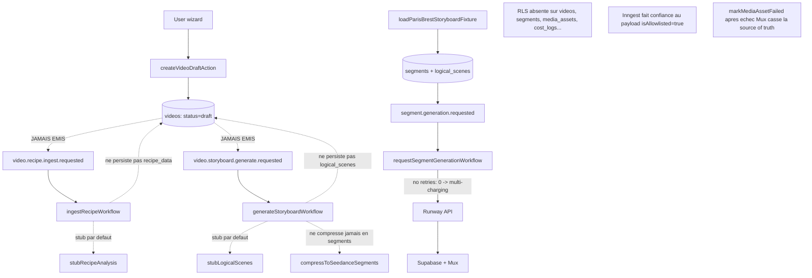
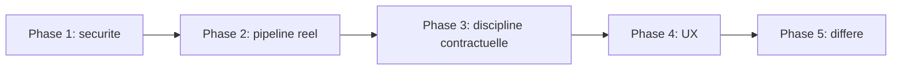

# Audit critique Recipe2Video — cartographie et plan d'action

Lecture seule effectuée sur l'ensemble du dépôt. Tous les findings ci-dessous sont confirmés par lecture directe du code, pas par inférence. Sévérités : **C** = bloquant démo publique, **H** = écart contractuel important, **M** = polish ou conformité UX, **L** = post-hackathon assumé.

## Cartographie des écarts par couche

Les trois entrées de pipeline (ingest, storyboard, références) ne sont reliées au flux que par la fixture Paris-Brest. Hors démo, l'app ne fait rien d'agentique.

## Phase 1 — Sécurité bloquante avant toute démo publique (C)

### 1.1 Activer RLS sur les tables métier
- **Constat** : `supabase/migrations/20260508195300_create_core_schema.sql` crée `videos`, `segments`, `logical_scenes`, `media_assets`, `reference_assets`, `generations`, `scene_feedbacks`, `cost_logs`, `compositions` **sans** `enable row level security`. Seule la migration auth (`20260508192500_auth_allowlist.sql`) active RLS sur `allowed_users` et `profiles`.
- **Risque** : le repo est public. `NEXT_PUBLIC_SUPABASE_URL` et `NEXT_PUBLIC_SUPABASE_PUBLISHABLE_KEY` sont visibles côté client. Sans RLS, n'importe qui peut faire `select *` sur ces tables via l'API REST Supabase.
- **Action** : nouvelle migration `20260509XXXX_enable_rls_core.sql` qui :
  - `alter table ... enable row level security` sur toutes les tables métier ;
  - politiques `select`/`update` restreintes par `auth.uid() = created_by` ou par appartenance `videos.created_by` (jointure pour `segments`, `generations`, `media_assets`...) ;
  - politique séparée pour le service role (admin client serveur).
- **Fichiers** : nouvelle migration + revue rapide des repositories pour vérifier qu'aucun `from('videos').select()` côté client ne casse.

### 1.2 Forcer `retries: 0` sur les fonctions Inngest qui appellent Runway
- **Constat** : [`inngest/functions/segment-generation.ts`](inngest/functions/segment-generation.ts) ne configure pas `retries`. Inngest retry 3 fois par défaut. `requestSegmentGenerationWorkflow` appelle `startSeedanceGeneration` PUIS `createGeneration`, `logCost`, `sendEvent`. Si l'un des steps post-API échoue, Inngest relance toute la fonction → nouvelle tâche Runway facturée.
- **Action** : ajouter `retries: 0` sur `requestSegmentGeneration`, `applySegmentFeedbackRegeneration`, `persistSegmentOutput`. Pour `pollSegmentGeneration` et `uploadSegmentMux`, garder `retries: 3` (idempotents). Documenter ce choix dans le contrat.

### 1.3 Revérifier l'allowlist côté worker Inngest
- **Constat** : tous les workflows lisent `data.requestedByUserId` et `data.isAllowlisted` du payload sans appeler `assertAllowlistedUser` en base. Voir `assertWorkflowAllowed` dans [`modules/generation/use-cases/orchestrate-segment-generation.ts:331`](modules/generation/use-cases/orchestrate-segment-generation.ts) et [`inngest/functions/planning-stubs.ts:110`](inngest/functions/planning-stubs.ts).
- **Action** : remplacer `assertWorkflowAllowed` par un appel réel à `assertAllowlistedUser(data.requestedByUserId)` au début de chaque handler. Retirer le champ `isAllowlisted` du payload (ne plus s'y fier).

### 1.4 Cesser de marquer l'asset `failed` quand Mux échoue
- **Constat** : [`modules/media-assets/use-cases/upload-media-asset-to-mux.ts:74-88`](modules/media-assets/use-cases/upload-media-asset-to-mux.ts) appelle `markMediaAssetFailed` même si l'original Supabase est intact. Contredit `docs/technical-contracts.md` § Storage Contract : « If Mux upload fails, the Supabase Storage original remains the source of truth and can be re-uploaded later. »
- **Action** : ne pas changer le statut (`stored` reste valide), tracer l'échec dans `metadata.mux.error`. Optionnellement ajouter une valeur `mux_upload_failed` à `MediaAssetStatus` si on veut un statut explicite — mais cela demande de mettre à jour le contrat avant.

## Phase 2 — Réparer le pipeline réel (C)

Aujourd'hui, sans cette phase, le produit ne fait que recharger une fixture. Il ne génère ni recettes, ni storyboard, ni segments depuis OpenAI.

### 2.1 Forcer `mode: "live"` dans tous les chemins de production
- **Constat** : [`modules/storyboard/services/gpt55-planning-prompt-engine.ts:62-64`](modules/storyboard/services/gpt55-planning-prompt-engine.ts) — sans `options.mode === "live"`, aucun client OpenAI n'est créé. Tous les workflows Inngest et `ingestRecipe` utilisent le constructeur sans options. Aucun appel OpenAI réel n'arrive jamais en production malgré `OPENAI_API_KEY`.
- **Action** : changer la sémantique. Le défaut devient `"live"` ; le mode `"stub"` doit être explicitement demandé (par exemple via `RECIPE2VIDEO_PLANNING_MODE=stub` ou en injectant un client mock dans les tests). Mettre à jour `inngest/functions/planning-stubs.ts`, `modules/recipe-ingest/ingest-recipe.ts`, et la modale fixture pour passer `mode: "live"` quand on veut le vrai LLM.

### 2.2 Émettre les événements Inngest depuis l'app
- **Constat** : `INNGEST_EVENTS.videoRecipeIngestRequested` et `INNGEST_EVENTS.videoStoryboardGenerateRequested` sont déclarés dans [`inngest/events.ts`](inngest/events.ts) mais aucun `inngest.send()` ne les émet (vérifié par grep global). Les workflows correspondants existent mais ne sont jamais déclenchés.
- **Action** :
  - Dans `createVideoDraftAction` (ou un sub-step dédié), émettre `video.recipe.ingest.requested` après la création du draft, en passant les sources collectées par le wizard.
  - Dans `ingestRecipeWorkflow`, après succès, émettre `video.storyboard.generate.requested`.
  - Optionnel : ajouter un bouton manuel "Re-run analysis" dans l'overview projet pour ré-émettre.

### 2.3 Persister les sorties OpenAI dans la DB
- **Constat** : [`inngest/functions/planning-stubs.ts:24-48`](inngest/functions/planning-stubs.ts) appelle `ingestRecipe` puis ne persiste rien dans `videos.recipe_data`. Idem pour `generateStoryboardWorkflow:62-75` qui ignore les `logicalScenes` retournés. Le statut passe à `recipe_ingested` / `storyboard_ready` sans données réelles.
- **Action** :
  - `ingestRecipeWorkflow` : `updateVideoProjectRecipeData(supabase, videoId, result.recipe)` (méthode à ajouter dans `videos.repository.ts`).
  - `generateStoryboardWorkflow` : enregistrer les `logicalScenes` via `insertLogicalScenes` (existe ou à créer dans `logical-scene.repository.ts`), puis appeler `compressToSeedanceSegments` et persister les segments via `insertSegments`.

### 2.4 Brancher la compression Seedance en production
- **Constat** : `compressToSeedanceSegments` est défini dans le moteur planning mais aucun import en dehors du fichier (vérifié par grep). La compression « 30-48 logical scenes → 5-10 Seedance segments » exigée par le PRD n'a aucun chemin de prod.
- **Action** : étendre `generateStoryboardWorkflow` pour enchaîner `generateLogicalScenes` puis `compressToSeedanceSegments` dans la même fonction Inngest, persister les deux, et émettre `video.storyboard.generate.completed` (à ajouter à `events.ts`) pour réveiller la suite.

### 2.5 Valider les sorties LLM avec un schéma strict
- **Constat** : `openAiClient.generateJson` appelle `parseJsonObject` sans schéma. Si le LLM renvoie 12 scènes au lieu de 30-48, ou un segment sans `references`, le code accepte et persiste.
- **Action** : ajouter Zod (déjà présent ? sinon `npm i zod`) et valider chaque réponse :
  - `RecipeAnalysisResultSchema`
  - `LogicalSceneArraySchema` avec `length >= MIN_LOGICAL_SCENES && length <= MAX_LOGICAL_SCENES`
  - `SeedanceSegmentArraySchema` avec `length >= 5 && length <= 10` et `references.length <= 9`
  - rejeter avec une erreur explicite si hors plage. Pas de réparation silencieuse.

### 2.6 Brancher l'événement et le handler `video.references.generate.requested`
- **Constat** : événement déclaré mais aucune fonction enregistrée dans [`inngest/functions/index.ts`](inngest/functions/index.ts).
- **Action** : créer `inngest/functions/references-generation.ts` qui appelle `generateReferenceImage` pour les références dont `status === 'planned'` et persiste l'image dans `reference-images/{videoId}/{referenceId}.{ext}`. Émettre `references.generate.completed` puis passer `videos.status` à `references_ready`.

### 2.7 Brancher `composition.render.requested`
- **Constat** : événement déclaré, aucun handler.
- **Action court terme** : ne pas l'implémenter mais le retirer de `events.ts` pour éviter la confusion.
- **Action long terme** : implémenter avec `@remotion/renderer` + Vercel Sandbox.

## Phase 3 — Discipline contractuelle (H)

### 3.1 Aligner sélecteur vidéo avec le workflow
- **Constat** : [`modules/videos/video.constants.ts:19-24`](modules/videos/video.constants.ts) expose `gen4.5`, `gen4_turbo`, `veo3.1_fast` mais [`orchestrate-segment-generation.ts:373-378`](modules/generation/use-cases/orchestrate-segment-generation.ts) rejette tout ce qui n'est pas `seedance2`. Un user qui choisit autre chose obtient une erreur opaque.
- **Action** : restreindre `VIDEO_MODEL_OPTIONS` à `seedance2` uniquement (avec une note "Default during the hackathon"), désactiver le dropdown, OU étendre `assertSeedance2Selected` en `assertSupportedVideoModel` qui accepte les modèles dont l'endpoint Runway équivalent est branché. Recommandation : restreindre, c'est plus court et plus clair.

### 3.2 Aligner `docs/technical-contracts.md`
- **Constat** : le contrat se contredit lui-même (« fallback `gen4.5` if Seedance 2 turns out to be web-app only » vs « No silent fallback »).
- **Action** : retirer la mention du fallback dans `docs/technical-contracts.md` § Runway Contract. Garder le warning sur l'incertitude `seedance2` dans `README.md` et le runbook, mais en spécifiant que la bascule est manuelle uniquement.

### 3.3 Compter `promptImage` dans la limite de 9 références
- **Constat** : [`modules/generation/services/runway.service.ts:301-310`](modules/generation/services/runway.service.ts) borne `references` à 9. Mais `buildSeedanceGenerationInput` extrait la première URI vers `promptImage` puis garde 9 supplémentaires dans `references` → potentiellement 10 images.
- **Action** : dans `normalizeSeedanceReferences`, calculer `total = (input.promptImage ? 1 : 0) + references.length` et tronquer.

### 3.4 Refuser la génération si références obligatoires manquantes
- **Constat** : [`buildRunwayReferences`](modules/generation/use-cases/orchestrate-segment-generation.ts:318-328) ne renvoie que les refs avec `runwayUri`. Si toutes sont en `approved` (Storage) mais pas encore `uploaded_to_runway`, le segment est généré sans aucune référence — alors que les règles imposent une `@KitchenIslandDefault` obligatoire.
- **Action** : ajouter un check dans `requestSegmentGenerationWorkflow` qui rejette si :
  - aucune référence n'a `runwayUri`, OU
  - aucune référence canonique kitchen n'est présente.
  Mettre le segment en `blocked` avec un message explicite et créer une notif UI.

### 3.5 Compléter les logs de coût manquants
- **Constat** : couvert par audit sécurité et coût. Manques :
  - `seedance_segment_generation_succeeded` avec crédits réels après poll terminal.
  - `reference_image_generated` pour les uploads Runway.
  - `media_asset_uploaded_to_mux` n'a pas d'estimation `cost_dollars` (durée × tarif Basic).
- **Action** :
  - dans `pollSegmentGenerationWorkflow` branche `SUCCEEDED`, ajouter un `logCost({ provider: 'runway', operation: 'seedance_segment_generation_succeeded', creditsUsed: actualCredits ?? estimatedCredits })`.
  - dans `uploadReferenceAssetToRunway`, logger un coût Runway (au moins informatif, l'upload lui-même est gratuit mais utile pour l'audit).
  - dans `uploadMediaAssetToMux`, calculer une estimation : `cost_dollars = durationSeconds * MUX_BASIC_PER_SECOND_USD` (constante à ajouter dans `cost.constants.ts`).

### 3.6 Fixer `markMediaAssetFailed` (déjà couvert en 1.4)

### 3.7 Lier `composition.audio_media_asset_id` à la piste réelle
- **Constat** : [`modules/assembly/use-cases/get-assembly-data.ts:133-151`](modules/assembly/use-cases/get-assembly-data.ts) prend la première `suno_audio` trouvée. Si l'utilisateur en a uploadé plusieurs (versions Suno A/B), l'app ignore son choix sauvegardé.
- **Action** : si `composition?.audioMediaAssetId` est défini, résoudre cet asset précis ; sinon fallback.

### 3.8 Empêcher `saveAssemblySettingsAction` de créer une nouvelle composition à chaque clic
- **Constat** : chaque save fait un `createComposition` (insert). L'historique gonfle.
- **Action** : si une composition existe pour `videoId`, faire un `update` ; sinon `insert`. Conserver `created_at` initial.

## Phase 4 — Conformité UX (M)

Volontairement plus léger : le runbook de la PR #41 documente déjà ces écarts. Mais quelques-uns nuisent à la démo :

### 4.1 Header live data
- Remplacer les badges statiques `Credits: pending` et `0 active tasks` dans [`components/layout/app-shell.tsx:77-78`](components/layout/app-shell.tsx) par les vraies valeurs (lire `getRunwayBudgetState` côté serveur dans le layout, et compter les generations en cours).
- Retirer "Library" qui pointe vers `/` (doublon avec Dashboard).

### 4.2 Project Overview enrichi
- [`app/(dashboard)/videos/[videoId]/page.tsx`](app/(dashboard)/videos/[videoId]/page.tsx) overview manque : recipe source, pipeline progress (6 steps), active tasks, cost summary.
- Ajouter un composant `ProjectPipelineProgress` qui montre les 6 étapes avec leur statut courant lu depuis `videos.status` + counts dérivés.

### 4.3 References : section "Missing" et action "Edit prompt"
- Ajouter une section dédiée listant les références dont `status === 'planned'` ou dont `runwayUri` est null.
- Bouton "Edit prompt" sur chaque carte qui ouvre un dialogue pour modifier le prompt avant régénération.

### 4.4 Active Generations : pause/resume/retry/cancel
- Ajouter un bouton global "Pause queue" qui écrit dans une nouvelle table `app_settings` (ou utilise une simple ligne `videos.metadata`) et que `isGenerationQueuePaused()` lit.
- Ajouter un bouton "Retry" et "Cancel" par ligne qui émet les events Inngest correspondants.

### 4.5 Segment Review : prompt history et bouton "Change model" par variante
- Lire l'historique depuis `scene_feedbacks` (filter `applied = true`) pour afficher les versions du prompt.
- Le bouton "Change model" peut renvoyer vers `RegenerationForm` pré-rempli.

### 4.6 Costs : export CSV et liens vers généralisations
- Ajouter une server action `exportCostLogsCsvAction` qui retourne un CSV via `Response`.
- Dans `RecentLogsCard`, lier chaque ligne au segment review correspondant (`/videos/{videoId}/segments/{segmentId}`).

### 4.7 Vignette projet
- Si le projet a un segment accepté avec `mux_playback_id`, utiliser la thumbnail Mux (`https://image.mux.com/{playbackId}/thumbnail.jpg`).
- Sinon garder le gradient actuel.

## Phase 5 — Différé post-démo (L)

Documenté tel quel dans le runbook. Pas de travail dans cette PR :
- TTS storyboard pitch.
- Trim-lite sur les segments dans l'assembly.
- Render Remotion server-side via `@remotion/renderer` ou Vercel Sandbox (en remplacement de `uploadFinalExportAction` qui accepte un MP4 utilisateur).
- Embeddings RAG sur `scene_feedbacks` (P1 PRD assumé).
- Tracking Plan PostHog (40+ événements PRD).
- Retirer la route `mux-test` de la nav et la mettre derrière un flag `NODE_ENV === 'development'`.

## Recommandation de séquence

- **Avant la démo de lundi** : Phase 1 + Phase 2 minimale (au moins 2.1, 2.2, 2.3 pour le storyboard) + Phase 3.1 (sélecteur vidéo) + Phase 4.1 (header live).
- **Si le temps presse** : skipper Phase 2 et garder le démo en mode fixture, mais alors **être honnête dans le runbook** que le pipeline live n'est pas branché — la PR #41 le note déjà partiellement.
- **Phase 5** : carnet de bord post-hackathon.

## Risques et arbitrages

- **Phase 1.1 RLS** : peut casser des read paths qui passent aujourd'hui par la `publishable_key` côté client. À tester via un manuel sur le dashboard, le storyboard, et la page costs avant merge.
- **Phase 2.1 mode live** : double les coûts OpenAI réels pendant les rehearsals. Prévoir un flag d'env pour repasser en stub pour les répétitions.
- **Phase 2.5 validation Zod** : peut faire échouer des sorties LLM imparfaites. Préférer **rejet explicite + retry manuel** plutôt que correction silencieuse — c'est exactement la philosophie « no silent fallback » du contrat.
- **Phase 3.1 sélecteur vidéo** : retirer les options `gen4.5` etc. peut surprendre si la PRD prévoit le fallback. Il faut d'abord aligner `docs/technical-contracts.md` (Phase 3.2).

## Tâches concrètes à exécuter (par ordre)

1. Migration RLS sur tables métier.
2. `retries: 0` sur les fonctions Inngest qui touchent Runway.
3. Revérification allowlist côté worker Inngest.
4. Fix `markMediaAssetFailed` après échec Mux.
5. Mode `"live"` par défaut dans `createGpt55PlanningPromptEngine`.
6. Émission de `video.recipe.ingest.requested` depuis `createVideoDraftAction`.
7. Persistance `videos.recipe_data` dans `ingestRecipeWorkflow`.
8. Persistance des `logical_scenes` puis appel à `compressToSeedanceSegments` puis persistance des `segments` dans `generateStoryboardWorkflow`.
9. Validation Zod des sorties LLM.
10. Brancher `video.references.generate.requested` ou retirer l'event.
11. Restreindre `VIDEO_MODEL_OPTIONS` à `seedance2` et corriger `docs/technical-contracts.md`.
12. Corriger compteur de références (promptImage + references = max 9).
13. Refuser la génération si la référence kitchen n'a pas de `runwayUri`.
14. Compléter les logs de coût manquants.
15. Aligner `composition.audio_media_asset_id` avec la piste audio chargée par Remotion.
16. Header live data + retirer "Library" doublon.
17. Project Overview : pipeline progress, active tasks, cost summary.
18. References : section "Missing" + action "Edit prompt".
19. Active Generations : pause/resume/retry/cancel.
20. Costs : export CSV + liens vers segments.

Cette liste représente environ 1-2 jours pour Phases 1-3 et 1 jour pour Phase 4. Phase 5 est exclue de la fenêtre hackathon.