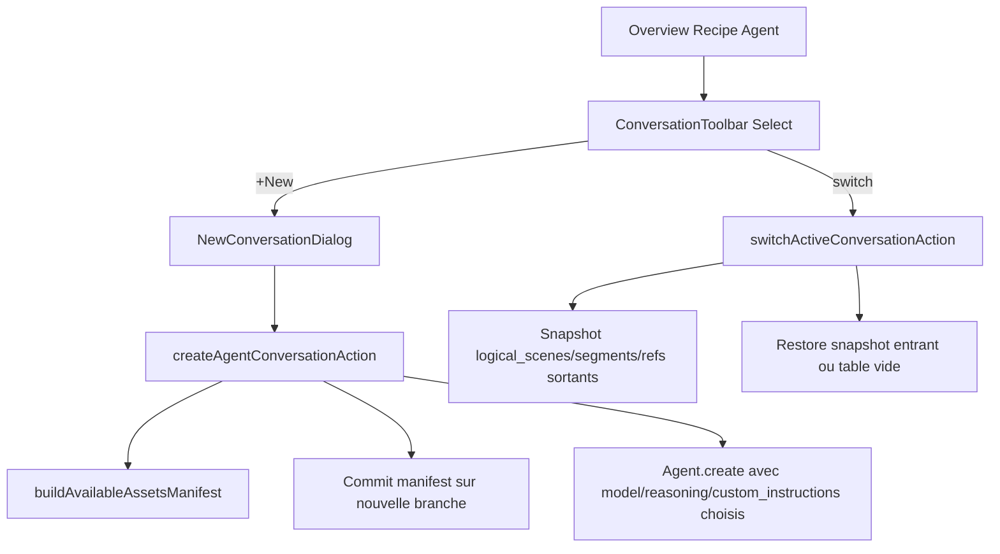

# Plan d'implémentation — Multi-conversations agent par vidéo

## 1. Comportement cible (vision)

- Sur la page Overview d'une vidéo, un sélecteur permet de choisir entre N conversations Cursor SDK, dont **une seule est active**.
- La conversation active **alimente** le storyboard, les segments, les ref-prompts (vue normalisée DB) et l'UI Recipe Agent (chat).
- Switcher la conversation active **archive** l'état courant et **restaure** l'état précédent de la conversation entrante (sans rejouer l'agent).
- Créer une nouvelle conversation depuis l'Overview ouvre un dialog : `name`, `model` Cursor, `reasoning`, `custom_instructions` (vide = pas d'instructions custom), checkbox "Inclure le manifeste d'assets déjà générés".
- À la création, l'app génère `available-assets.json` listant **uniquement** les `reference_assets` avec image effectivement générée + les `generations` vidéo finalisées (segments MP4 effectifs), avec URL signée + description + canonical_name. **Aucun** storyboard / segment-prompt / decisions.md précédent n'est exposé.
- `reference_assets` et `media_assets` (images de ref + MP4 segments) restent **mutualisés au niveau vidéo** : aucune perte du travail payé. Une conversation peut "ignorer" un asset (il reste dans le pool mais n'est plus référencé par les prompts actifs).
- Sur Git : **une branche par conversation** `recipe2video/{videoId}/{conversationSlug}`, dossier toujours `agent-recipes/{videoId}/`. Branches issues de la branche par défaut (fresh start).



## 2. Modèle de données

### Nouvelle table `agent_conversations`

Nouvelle migration `supabase/migrations/<ts>_agent_conversations.sql` :

```sql
create table public.agent_conversations (
  id uuid primary key default gen_random_uuid(),
  video_id uuid not null references public.videos(id) on delete cascade,
  name text not null,
  cursor_agent_id text,
  cursor_agent_runtime text,
  agent_workspace_path text,
  agent_git_branch text,
  agent_git_commit_sha text,
  agent_status text not null default 'idle',
  last_agent_run_id text,
  last_agent_sync_at timestamptz,
  cursor_agent_model text not null,
  cursor_agent_reasoning text,
  cursor_agent_fast boolean not null default false,
  custom_instructions text,
  include_assets_manifest boolean not null default true,
  is_active boolean not null default false,
  archived_at timestamptz,
  created_at timestamptz not null default now(),
  updated_at timestamptz not null default now(),
  constraint agent_conversations_video_name_unique unique (video_id, name)
);

create unique index agent_conversations_one_active_per_video
  on public.agent_conversations(video_id)
  where is_active = true;
```

### Ajouter FK `agent_conversation_id` + `is_active` aux tables existantes

- [`logical_scenes`](supabase/migrations/20260508195300_create_core_schema.sql) : `+ agent_conversation_id uuid references agent_conversations(id) on delete cascade`, `+ is_active boolean not null default true`. Drop l'unique `(video_id, position)`, remplacer par `unique (video_id, position) where is_active = true`.
- [`segments`](supabase/migrations/20260508195300_create_core_schema.sql) : idem.
- [`segment_references`](supabase/migrations/20260511220000_asset_library_and_segment_references.sql) : `+ agent_conversation_id uuid` non null + `is_active` (default true), même logique.
- [`agent_artifacts`](supabase/migrations/20260510043000_recipe_agent_data_model.sql) : `+ agent_conversation_id uuid`. Unique devient `(video_id, agent_conversation_id, artifact_name)`.
- [`agent_runs`](supabase/migrations/20260510043000_recipe_agent_data_model.sql) : `+ agent_conversation_id uuid not null` (FK cascade).
- [`recipe_agent_threads`](supabase/migrations/20260511194500_recipe_agent_chat.sql) : `+ agent_conversation_id uuid`. Unique devient `(video_id, agent_conversation_id)`.

`reference_assets`, `media_assets`, `generations` **ne sont pas touchés** : ils restent global au `video_id`. C'est exactement ce qui permet de ne pas perdre le travail payé.

### Migration "data" pour vidéos existantes

Dans la même migration, pour chaque `videos` ayant `cursor_agent_id != null` :
1. Insérer une row `agent_conversations` (`name='Initial'`, `is_active=true`, copier `cursor_agent_id`, `cursor_agent_runtime`, `agent_workspace_path`, `agent_git_branch`, `agent_git_commit_sha`, `agent_status`, `last_agent_run_id`, `last_agent_sync_at`, et `cursor_agent_model`/`reasoning`/`fast` depuis `recipe_data.productionDefaults`, `custom_instructions` depuis `recipe_data.complementaryAgentInstructions`).
2. Mettre à jour `logical_scenes/segments/segment_references/agent_artifacts/agent_runs/recipe_agent_threads` pour pointer dessus.
3. Vider les colonnes miroir sur `videos` (ou les garder en cache de lecture — voir §6).

### Types TS

- Étendre [`modules/videos/video.types.ts`](modules/videos/video.types.ts) : nouvelle interface `AgentConversation`.
- Étendre [`shared/supabase/database.types.ts`](shared/supabase/database.types.ts) via regénération.

## 3. Couche service `cursor-agent.service.ts`

Modifications dans [`modules/recipe-agent/services/cursor-agent.service.ts`](modules/recipe-agent/services/cursor-agent.service.ts) :

- `CreateRecipeAgentInput` accepte désormais `conversationId`, `conversationSlug`, `branch` (override de `recipe2video/{videoId}`), et un override `configOverride: { model?, modelReasoning?, modelFast?, complementaryInstructions? }`.
- `buildAgentOptions` (l.137-203) :
  - Le nom de l'agent Cursor devient `Recipe2Video: {title} — {conversationName}`.
  - Le prompt du subagent `recipe-project-guardian` est construit avec la nouvelle branche dédiée à la conversation.
  - `cloud.repos[0].startingRef` reste `main` (branche par défaut) — l'agent crée sa propre branche.
- Nouveau builder `buildRecipeAgentGuardianSubagentPrompt` ([`recipe-agent.instructions.ts`](modules/recipe-agent/recipe-agent.instructions.ts) l.18-29) prend en argument `branchName` au lieu de le déduire de `videoId`.

Le `resolveRecipeAgentConfig` ([`recipe-agent.config.ts`](modules/recipe-agent/recipe-agent.config.ts)) reste env-driven mais sera **overridé par-conversation** dans `orchestrate-recipe-agent.ts` via `resolveProjectRecipeAgentConfigOverride`, étendu pour lire `conversation.cursor_agent_model/_reasoning/_fast` au lieu de `recipe_data.productionDefaults`.

## 4. Orchestration `orchestrate-recipe-agent.ts`

Dans [`modules/recipe-agent/use-cases/orchestrate-recipe-agent.ts`](modules/recipe-agent/use-cases/orchestrate-recipe-agent.ts) :

- `ensureRecipeAgent(videoId)` devient `ensureRecipeAgentForConversation(videoId, conversationId)`.
- `sendRecipeAgentMessage` reçoit `conversationId`. Toute lecture/écriture passe par les colonnes de `agent_conversations` au lieu de `videos`.
- `agent_not_found` (l.350-374) : efface uniquement les colonnes de **la conversation concernée**, recréée pour cette conversation seule.
- Le sync post-run (§5) est **conditionnel à `conversation.is_active`** :
  - Si active : sync DB normalisée + `agent_artifacts`.
  - Si inactive : sync uniquement `agent_artifacts` (et fichiers Git via checkpoint).

## 5. Sync `sync-recipe-agent-artifacts.ts`

Dans [`modules/recipe-agent/use-cases/sync-recipe-agent-artifacts.ts`](modules/recipe-agent/use-cases/sync-recipe-agent-artifacts.ts) :

- Toutes les fonctions reçoivent `agentConversationId`.
- `upsertAgentArtifact` filtre par `(video_id, agent_conversation_id, artifact_name)`.
- `replaceLogicalScenesForVideo` / `upsertLogicalScenesForVideoByPosition` filtrent par `agent_conversation_id` ET `is_active=true`. Idem `segments` et `segment_references`.
- La logique `useNonDestructiveStoryboardSync` (l.333-378) reste, mais le scope `existingSegments` est restreint à la conversation courante.
- `reference-plan.json` continue d'upserter `reference_assets` **sans** scope conversation (mutualisation).

### Nouveau use-case `switch-active-conversation.ts`

Nouveau fichier `modules/recipe-agent/use-cases/switch-active-conversation.ts` :

```ts
export async function switchActiveConversation(input: {
  supabase: SupabaseClient<Database>;
  videoId: string;
  fromConversationId: string | null;
  toConversationId: string;
}): Promise<void>;
```

Étapes :
1. Transaction Postgres :
   - `UPDATE agent_conversations SET is_active = false WHERE video_id = $1 AND id = $fromConversationId`.
   - `UPDATE logical_scenes SET is_active = false WHERE video_id = $1 AND agent_conversation_id = $fromConversationId`.
   - Idem `segments`, `segment_references`.
   - `UPDATE agent_conversations SET is_active = true WHERE id = $toConversationId`.
   - `UPDATE logical_scenes SET is_active = true WHERE video_id = $1 AND agent_conversation_id = $toConversationId`.
   - Idem `segments`, `segment_references`.
2. Met à jour les colonnes miroir sur `videos` (cursor_agent_id, agent_status, etc.) avec celles de la conversation entrante (pour ne pas casser les lecteurs existants pendant la transition).
3. `revalidatePath` sur la page Overview, Storyboard, Segments, References.

Switch idempotent et réversible (aucune perte de données : seul le flag bascule).

## 6. Briefing du nouvel agent — `available-assets.json`

Nouveau fichier `modules/recipe-agent/use-cases/build-available-assets-manifest.ts`. Appelé à la **création** d'une nouvelle conversation, si `include_assets_manifest=true`.

Structure produite (commit sur la nouvelle branche dans `agent-recipes/{videoId}/available-assets.json`) :

```json
{
  "schema": "available_assets_v1",
  "generatedAt": "2026-05-21T09:00:00Z",
  "videoId": "...",
  "fromConversationId": "...",
  "references": [
    {
      "canonicalName": "kitchen_island_default",
      "role": "background",
      "description": "Top-down marble kitchen island in soft daylight",
      "tags": ["kitchen", "background"],
      "url": "https://...signed-15min/...png",
      "runwayUri": "rw://...",
      "source": "asset_library | recipe_reference"
    }
  ],
  "videoSegments": [
    {
      "title": "Pouring the cream",
      "description": "Hands slowly pouring fresh cream into a copper bowl",
      "durationSeconds": 8,
      "url": "https://...signed-15min/...mp4",
      "mediaAssetId": "...",
      "previousSegmentTitle": "Cream prep"
    }
  ]
}
```

Critères stricts :
- **Références** : `reference_assets.status IN ('generated','approved','uploaded_to_runway')` AND `media_asset_id IS NOT NULL` (image effectivement présente). Plus toutes les `asset_library` déjà accessibles via `@`-aliases (incluses pour exhaustivité).
- **Segments vidéo** : `generations.status='finished'` AND `media_asset_id IS NOT NULL` AND le MP4 existe dans Storage. **Pas** filtré par segment actif : on inclut tous les MP4 jamais générés pour cette vidéo, même si leur segment d'origine n'est plus actif.
- Description : tirée de `segments.description` (ou `prompt_initial` tronqué) au moment de la génération.

Le manifeste est appelé **une seule fois à la création**. Les nouvelles refs/segments produits par les conversations parallèles n'apparaîtront pas automatiquement — l'utilisateur peut régénérer le manifeste manuellement via un bouton.

### Instructions injectées

Le **premier message** envoyé au nouvel agent (étendre [`create-video-agent-message.ts`](modules/videos/use-cases/create-video-agent-message.ts) l.64-70) inclut :

```
Pre-existing assets manifest:
- Read `agent-recipes/{videoId}/available-assets.json` BEFORE planning references or segments.
- Each entry includes a `canonicalName`, description, and signed URL.
- If a listed asset fits your plan, reuse its `canonicalName` in your reference-plan.json and seedance-segments.json (do not regenerate similar assets).
- If you intentionally do not need a listed asset, simply omit it — it stays in the project library but won't be referenced in your prompts.
- DO NOT consult prior storyboard, segment prompts, or decisions from previous conversations.
```

Le subagent guardian ([`recipe-agent.instructions.ts`](modules/recipe-agent/recipe-agent.instructions.ts)) reçoit également une règle de **boundary** : « Do not open files like `recipe-analysis.json`/`logical-scenes.json`/`seedance-segments.json`/`reference-plan.json`/`decisions.md` from the default branch — they belong to other conversations. »

## 7. UI / UX

### Hook et résolution

- Nouveau hook `modules/recipe-agent/ui/use-active-conversation-id.ts`, calqué sur [`use-active-preset-id.ts`](modules/assembly/ui/use-active-preset-id.ts) :
  - Source de vérité = `?conversation=<id>` dans l'URL, fallback serveur, fallback premier item (préférer `is_active=true`).
  - Écrit dans `localStorage` avec clé `recipe-agent:active-conversation:{videoId}`.
- Server-side resolver `modules/recipe-agent/resolve-active-conversation.ts` (calqué sur [`resolve-active-preset.ts`](modules/assembly/resolve-active-preset.ts)).

### Composants

Dans [`modules/recipe-agent/ui/recipe-agent-panel.tsx`](modules/recipe-agent/ui/recipe-agent-panel.tsx) :

- Nouveau header `RecipeAgentConversationToolbar` :
  - `<Select>` shadcn des conversations (montre `name` + badge `is_active`).
  - Bouton **"New conversation"** → `NewConversationDialog`.
  - `<DropdownMenu>` (Rename, Delete, Refresh assets manifest).
  - À la sélection : `setActiveConversationId(id)` puis appel `switchActiveConversationAction(videoId, id)`.

- `NewConversationDialog` (nouveau composant) :
  - Champ `name` (text, requis, unique par vidéo).
  - `<Select>` `cursor_agent_model` (mêmes options que le wizard : voir [`video.constants.ts`](modules/videos/video.constants.ts) l.20-71).
  - `<Select>` `cursor_agent_reasoning` (dynamique selon le modèle, comme dans [`new-video-wizard-form.tsx`](modules/videos/ui/new-video-wizard-form.tsx)).
  - `<Textarea>` `custom_instructions` (placeholder : « Laisser vide pour ne pas reprendre les instructions précédentes »). Pas de défaut hérité.
  - `<Checkbox>` "Inclure le manifeste des assets déjà générés" (default checked).
  - Submit → `createAgentConversationAction`.

- Le panel principal (chat, runs, artifacts) prend `key={activeConversationId}` pour forcer un remount complet à chaque switch.

### Sidebar et autres pages

- La subnav ([`video-project-subnav.tsx`](modules/videos/ui/video-project-subnav.tsx)) propage `?conversation=` dans tous ses liens.
- Les pages [Storyboard](app/(dashboard)/videos/[videoId]/storyboard/page.tsx), [Segments](app/(dashboard)/videos/[videoId]/segments/page.tsx), [References](app/(dashboard)/videos/[videoId]/references/page.tsx) lisent l'`activeConversationId` (URL ou DB) :
  - Storyboard / Segments : filtrent par `agent_conversation_id` + `is_active=true`.
  - References : pas de filtre (vue globale du pool — c'est le comportement souhaité pour la mutualisation).

## 8. Server actions

Étendre [`modules/recipe-agent/actions.ts`](modules/recipe-agent/actions.ts) :

- `createAgentConversationAction({ videoId, name, model, reasoning, fast, customInstructions, includeAssetsManifest })` :
  1. Insert `agent_conversations` row (`is_active=false`).
  2. Si `includeAssetsManifest`, build + commit `available-assets.json` sur la nouvelle branche via PAT GitHub (réutiliser [`agent-workspace-github.ts`](modules/library/services/agent-workspace-github.ts) qui sait déjà faire un commit).
  3. Enqueue Inngest `recipe.agent.create.requested` avec `conversationId`. L'orchestrateur fera `Agent.create` (avec model/reasoning custom) et enverra le premier message.
  4. Optionnellement : si l'utilisateur clique "Switch & create", chaîne avec `switchActiveConversationAction` une fois l'agent prêt (peut être un toggle).

- `switchActiveConversationAction(videoId, conversationId)` → appelle `switchActiveConversation` use-case.

- `renameAgentConversationAction`, `deleteAgentConversationAction` (interdit si dernière conversation), `refreshAssetsManifestAction` (regénère le manifeste + nouveau commit).

- `submitRecipeAgentMessageAction` reçoit `conversationId` (ou `activeConversationId` par défaut).

## 9. Inngest

Dans [`inngest/functions/recipe-agent.ts`](inngest/functions/recipe-agent.ts) et [`inngest/events.ts`](inngest/events.ts) :

- Tous les events `recipe.agent.*` reçoivent `conversationId` dans leur payload.
- Le handler `recipe.agent.create.requested` reçoit le `conversationId` et appelle l'orchestrateur avec le bon scope.

## 10. Compatibilité ascendante

- Les colonnes miroir sur `videos` (`cursor_agent_id`, `agent_status`, etc.) sont **maintenues** comme cache de la conversation active. Tous les lecteurs existants continuent de fonctionner pendant la transition.
- Un trigger Postgres (ou un hook applicatif dans `switchActiveConversation` / `sync*`) maintient le miroir cohérent.
- Aucune destruction de data existante : la migration crée une conversation `Initial` et déplace les FK proprement.

## 11. Risques & points d'attention

- **Concurrence** : deux agents qui finissent leur run quasi-simultanément doivent pouvoir écrire dans `agent_artifacts` sans collision → l'unique `(video_id, conversation_id, artifact_name)` couvre.
- **Storage** : les fichiers Storage (`reference-images/`, `runway-outputs/`) ne sont jamais supprimés par switch — seuls les liens DB changent. Cleanup éventuel hors scope.
- **Outro standardisé** (voir `seedance-outro-template.ts`) : reste injecté à chaque sync, donc identique entre conversations. OK.
- **Coût Cursor** : chaque conversation = un agent persistant côté Cursor Cloud. Penser à un `Delete conversation` qui appelle aussi `sdk.delete(agentId)` quand l'API le permet (sinon laisser l'agent dormir).
- **Branches Git** : si l'utilisateur supprime une conversation, on peut soit supprimer la branche (via PAT) soit la conserver pour audit. Par défaut : conserver et marquer la conv comme `deleted_at`.
- **Doc** : mettre à jour [`AGENTS.md`](AGENTS.md), [`docs/agent-workflow.md`](docs/agent-workflow.md), [`docs/recipe-agent-github-checkpoints.md`](docs/recipe-agent-github-checkpoints.md) pour mentionner la convention `recipe2video/{videoId}/{conversationSlug}`.

## 12. Découpage en lots livrables

1. **Schéma DB + migration data** (lot 1, sans changement comportement).
2. **Refacto service + orchestrate + sync pour porter `conversationId`** (lot 2, toujours 1 conv par vidéo, comportement inchangé en UI).
3. **`switch-active-conversation` + tests** (lot 3).
4. **`build-available-assets-manifest` + commit Git** (lot 4).
5. **UI : Toolbar, Select, Dialog, hook, resolver** (lot 5).
6. **Adaptation pages Storyboard/Segments/References + subnav** (lot 6).
7. **Inngest + actions** (lot 7).
8. **Doc + nettoyage colonnes miroir si on décide de les supprimer** (lot 8).