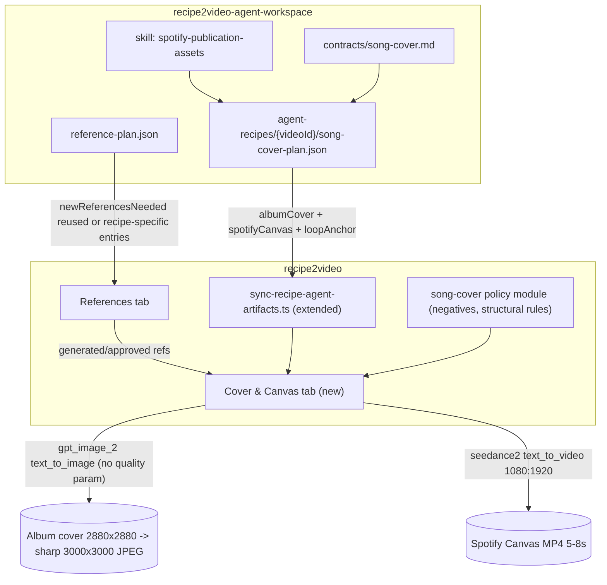

# Cover & Canvas tab — Spotify publication assets

## 1. Goal

Ship two streaming-publication artifacts per video project:

- **Album cover**, 3000x3000 JPEG, generated by Runway `gpt_image_2` (largest square Runway exposes — to confirm at impl, `2880:2880` if available else `2048:2048`), upscaled to 3000x3000 at download time via `sharp`. Default Runway `quality` (do NOT pass the param — same convention as today's references in [modules/references/use-cases/orchestrate-reference-generation.ts](modules/references/use-cases/orchestrate-reference-generation.ts) which only passes `promptText`, `ratio`, `model`, `referenceImages`).
- **Spotify Canvas**, 9:16 vertical 1080:1920 MP4, 5-8 seconds, generated by Runway `seedance2` text_to_video with `references[]` and optional `referenceVideos[]`. Reuses the existing `RUNWAY_DEFAULT_VIDEO_RATIO = "1080:1920"` constant from [modules/generation/runway.constants.ts](modules/generation/runway.constants.ts).

Both artifacts are **optional** (TikTok pipeline ships independently). Both keep full variant history like references (no destructive regen).

The **agent** in `recipe2video-agent-workspace` is responsible for the creative choices: prompts, anchor selection (image refs for cover, image + optional video refs for Canvas), Canvas duration, and explicit designation of the loop anchor reference. The app contains zero canonical prompt template here (unlike the outro): it only enforces Spotify policy negatives and structural validation.

## 2. Architecture



## 3. Cross-cutting concerns checklist (rigorous - ALL must be done in lockstep)

Listed once, expanded in §4-§9. Each PR must verify every relevant box.

**Validation surface** (anywhere a new field flows through):

- Zod schemas for the agent artifact (parse + validate at sync time): `modules/recipe-agent/song-cover-plan.schema.ts` (new), mirrored as a TS interface.
- Zod schemas for the server actions (operator edits prompt / refs / loop anchor / duration / upload override).
- DB-level constraints (CHECK constraint on duration window, NOT NULL on loop anchor for canvas kind, unique on `(video_id, kind)`).
- Cross-field invariants validated server-side: `loopAnchorReferenceName` must appear in `imageReferences`; every canonical name referenced must resolve to either `asset_library` or a `reference_assets` row for the same `video_id`; durations are integer seconds in [5, 8].
- Validator regex sanity-check: Canvas prompt must mention `@<loopAnchorReferenceName>` AND one of `loop`/`first frame`/`last frame`. Warn-only if missing (lets the operator override on their own responsibility).

**Contracts that must stay aligned** (change one, change all):

- [recipe2video-agent-workspace/contracts/song-cover.md](../recipe2video-agent-workspace/contracts/song-cover.md) — new file (source of truth for agent).
- [recipe2video-agent-workspace/contracts/artifact-schemas.md](../recipe2video-agent-workspace/contracts/artifact-schemas.md) — add a section that points at `song-cover.md`.
- App-side Zod schema (`song-cover-plan.schema.ts`) must accept exactly the contract.
- Skill [recipe2video-agent-workspace/.cursor/skills/spotify-publication-assets/SKILL.md](../recipe2video-agent-workspace/.cursor/skills/spotify-publication-assets/SKILL.md) — new (creative guidance).
- Worked example [recipe2video-agent-workspace/examples/paris-brest/song-cover-plan.json](../recipe2video-agent-workspace/examples/paris-brest/song-cover-plan.json) — must pass the Zod schema.
- [recipe2video-agent-workspace/AGENTS.md](../recipe2video-agent-workspace/AGENTS.md) — mention the new artifact in the artifact list.
- [recipe2video-agent-workspace/.cursor/skills/seedance-workflow/SKILL.md](../recipe2video-agent-workspace/.cursor/skills/seedance-workflow/SKILL.md) — pointer to the new skill.
- [recipe2video-agent-workspace/.cursor/skills/asset-reference-system/SKILL.md](../recipe2video-agent-workspace/.cursor/skills/asset-reference-system/SKILL.md) — note that song-cover can reference both globals and recipe-specific names.
- [recipe2video-agent-workspace/README.md](../recipe2video-agent-workspace/README.md) — add to the artifact list.

**Agent integration touch points** (app side):

- New stage `publication_planning` in [modules/recipe-agent/recipe-agent.types.ts](modules/recipe-agent/recipe-agent.types.ts) (`RecipeAgentStage` union).
- New initial agent instruction block for that stage in [modules/recipe-agent/recipe-agent.instructions.ts](modules/recipe-agent/recipe-agent.instructions.ts) that explicitly cites the contract and asks for `song-cover-plan.json` only.
- Stage routing in [modules/recipe-agent/services/cursor-agent.service.ts](modules/recipe-agent/services/cursor-agent.service.ts) to handle the new stage. Verify tests in [modules/recipe-agent/services/cursor-agent.service.test.ts](modules/recipe-agent/services/cursor-agent.service.test.ts) cover it.
- Sync entry point in [modules/recipe-agent/use-cases/sync-recipe-agent-artifacts.ts](modules/recipe-agent/use-cases/sync-recipe-agent-artifacts.ts) reads the artifact via GitHub like the other artifacts ([modules/recipe-agent/services/github-recipe-artifacts.service.ts](modules/recipe-agent/services/github-recipe-artifacts.service.ts)). Verify tests in [modules/recipe-agent/use-cases/sync-recipe-agent-artifacts.test.ts](modules/recipe-agent/use-cases/sync-recipe-agent-artifacts.test.ts) add a new case.
- CTA from the empty-state Cover & Canvas page: server action emits `recipe.agent.message.requested` with the new stage value.
- The agent artifact is **optional** in the checkpoint manifest at first (absent = empty state, not error). The Inngest sync handler must not fail if the file is missing.

**Storage and media plumbing**:

- Two new buckets in a Supabase migration: `album-covers`, `spotify-canvases`. RLS policies aligned with `runway-outputs` (allowlist read/write).
- Two new `MediaAssetType` values: `album_cover_image`, `spotify_canvas_video`. Update [modules/media-assets/media-asset.types.ts](modules/media-assets/media-asset.types.ts) AND [modules/media-assets/media-asset.constants.ts](modules/media-assets/media-asset.constants.ts) (`MEDIA_ASSET_STORAGE_BUCKET_BY_TYPE` map). Both must change in the same diff.
- Storage path helpers in [modules/media-assets/storage-paths.ts](modules/media-assets/storage-paths.ts): `{videoId}/{kind}/{variantId}.{ext}`.

**Inngest plumbing**:

- New events in [inngest/events.ts](inngest/events.ts): `song.cover.generate.requested`, `song.cover.poll.requested`, `song.cover.output.persist.requested`, `song.canvas.generate.requested`, `song.canvas.poll.requested`, `song.canvas.output.persist.requested`. Add their payload types to `Recipe2VideoEventPayloads`.
- New functions [inngest/functions/song-cover-generation.ts](inngest/functions/song-cover-generation.ts) and [inngest/functions/song-canvas-generation.ts](inngest/functions/song-canvas-generation.ts).
- Register both in [inngest/functions/index.ts](inngest/functions/index.ts).

**Cost logging**:

- New `operation` strings: `album_cover_generation_started`, `album_cover_generation_persisted`, `spotify_canvas_generation_started`, `spotify_canvas_generation_persisted`. Logged via `logCost` with the existing `costs` repo. No change to Costs UI required.

**Tests aligned with each change**:

- DB migration tested by an idempotency check (`npm run db:reset && db:migrate`).
- Zod schema unit test covering happy path + every invariant (duration, loop anchor in image refs, unknown canonical names).
- Sync use-case test (extension of [modules/recipe-agent/use-cases/sync-recipe-agent-artifacts.test.ts](modules/recipe-agent/use-cases/sync-recipe-agent-artifacts.test.ts)).
- Use-case tests for `generate-album-cover`, `generate-spotify-canvas`, mirroring [modules/references/use-cases/orchestrate-reference-generation.test.ts](modules/references/use-cases/orchestrate-reference-generation.test.ts).
- Inngest function tests for the two new flows.

## 4. Data model

Migration `supabase/migrations/2026MMDDHHMMSS_song_cover_artifacts.sql`:

```sql
create type song_cover_artifact_kind as enum ('album_cover', 'spotify_canvas');

create table song_cover_artifacts (
  id uuid primary key default gen_random_uuid(),
  video_id uuid not null references videos(id) on delete cascade,
  kind song_cover_artifact_kind not null,
  prompt text not null,
  image_reference_canonical_names text[] not null default '{}',
  video_reference_canonical_names text[] not null default '{}',
  loop_anchor_reference_name text,
  duration_seconds integer,
  status reference_status not null default 'planned',
  active_media_asset_id uuid references media_assets(id),
  runway_task_id text,
  runway_task_status runway_task_status,
  runway_progress numeric,
  created_by uuid references auth.users(id),
  created_at timestamptz not null default now(),
  updated_at timestamptz not null default now(),
  unique (video_id, kind),
  check (
    (kind = 'album_cover'
     and video_reference_canonical_names = '{}'
     and loop_anchor_reference_name is null
     and duration_seconds is null)
    or
    (kind = 'spotify_canvas'
     and loop_anchor_reference_name is not null
     and duration_seconds between 5 and 8)
  )
);
```

Reuses existing `reference_status` and `runway_task_status` enums. RLS policies mirror `reference_assets`.

Two extra buckets in a follow-up migration: `album-covers`, `spotify-canvases`.

Variants follow the existing pattern: stored as `media_assets` rows with the new type and `metadata.song_cover_artifact_id = <id>`. Active variant selection updates `song_cover_artifacts.active_media_asset_id`, identical to [modules/references/use-cases/select-reference-image-variant.ts](modules/references/use-cases/select-reference-image-variant.ts).

## 5. Agent contract (recipe2video-agent-workspace)

New file [contracts/song-cover.md](../recipe2video-agent-workspace/contracts/song-cover.md). Strict JSON, schemaVersion 1:

```json
{
  "schemaVersion": 1,
  "albumCover": {
    "prompt": "string - full GPT-Image 2 prompt, references anchors by @Name",
    "conditioningReferences": ["KitchenIslandDefault", "CharacterSheet", "FinalDishVisual"],
    "notes": "optional"
  },
  "spotifyCanvas": {
    "prompt": "string - explicit instruction that first and last frame must be @loopAnchor",
    "imageReferences": ["KitchenIslandDefault", "CharacterSheet", "PralineMacroFoodPorn"],
    "videoReferences": [],
    "loopAnchorReferenceName": "PralineMacroFoodPorn",
    "durationSeconds": 5,
    "mascotAppearanceMode": "discrete_gesture",
    "notes": "optional"
  },
  "qualityChecks": {
    "noTextOnScreen": true,
    "noLogoOrUrl": true,
    "noLipsyncToMusic": true,
    "mascotAppearsAtLeastOnce": true,
    "loopAnchorIsAlsoInImageReferences": true,
    "durationWithinSpotifyWindow": true
  }
}
```

Key rules embedded in the contract (also re-enforced by the app at sync time):

- Image references can be any global library canonical name OR any recipe-specific reference already declared in `reference-plan.json`. They do NOT need to be square.
- Video references are optional. Use them only when a specific motion needs grounding. `LicornOutroVideo` is appropriate ONLY when the artistic direction is a mascot celebration — NOT for routine discrete gestures.
- If the agent decides the existing references do not cover a beat the Canvas needs (e.g. a praline macro shot in slow drip), it declares a new entry in `reference-plan.json` with `source: "generated_reference_needed"` and lists the new canonical name in the Canvas plan. The new entry follows the standard reference-image-generation contract.
- `loopAnchorReferenceName` MUST be present in `imageReferences`. The Canvas prompt MUST explicitly say first frame and last frame are this anchor.
- `durationSeconds` MUST be in [5, 8] (Spotify max 8, Seedance min 5).

## 6. Agent skill (recipe2video-agent-workspace)

New skill [.cursor/skills/spotify-publication-assets/SKILL.md](../recipe2video-agent-workspace/.cursor/skills/spotify-publication-assets/SKILL.md). Internalizes the brief:

- **Album cover direction**: square 1:1, kitchen identity recognizable, mascot present (joy/triumph pose), finished dish hero in front, food porn allowed, no text on the artwork.
- **Canvas direction**: 9:16 vertical 5-8 s, food porn cinematic, kitchen recognizable, hero dish central, mascot appears at least once as a discrete reversible gesture (a hand sprinkling, sliding a tool, depositing a topping) — NEVER occupying the frame by default, never a celebration unless the recipe specifically warrants one.
- **Loop strategy**: text_to_video with explicit prompt instruction. Pick a static visual moment as the loop anchor (existing reference or a newly planned one). Never use Seedance first_last_frames mode (it blocks references[]).
- **Anchor reuse vs. new ref**: prefer reuse when a usable reference exists. Declare a new `reference-plan.json` entry only when the Canvas needs a different visual moment than anything already planned (often a more food-porn intermediate like a praline pour, a glaze drip, a crack reveal). Reference shape need not be square — gpt_image_2 and Seedance both handle non-square anchors.
- **Spotify policy guardrails**: no text/logo/URL, no human face, no lipsync to music, safe area = upper half (lower half is covered by Spotify controls), no rapid cuts or intense flashes.
- **Mascot policy**: present but discreet. Default = a hand or partial appearance. Full body celebration is a special case, not a default.

Also touched:

- [.cursor/skills/seedance-workflow/SKILL.md](../recipe2video-agent-workspace/.cursor/skills/seedance-workflow/SKILL.md): one paragraph pointer to the new skill.
- [.cursor/skills/asset-reference-system/SKILL.md](../recipe2video-agent-workspace/.cursor/skills/asset-reference-system/SKILL.md): mention that song-cover-plan can reference any global or recipe-specific canonical name.
- [.cursor/agents/recipe-researcher.md](../recipe2video-agent-workspace/.cursor/agents/recipe-researcher.md): add `song-cover-plan.json` as a stage-3 deliverable (publication_planning).
- [examples/paris-brest/song-cover-plan.json](../recipe2video-agent-workspace/examples/paris-brest/song-cover-plan.json): worked example using the existing Paris-Brest reference plan.
- [examples/paris-brest/README.md](../recipe2video-agent-workspace/examples/paris-brest/README.md), [README.md](../recipe2video-agent-workspace/README.md), [AGENTS.md](../recipe2video-agent-workspace/AGENTS.md): pointers and artifact list updates.

## 7. App-side pipelines

### 7.1 Shared extractions (foundation PR)

- Extract a generic GPT-Image 2 orchestrator: [modules/generation/use-cases/orchestrate-gpt-image-generation.ts](modules/generation/use-cases/orchestrate-gpt-image-generation.ts), parameterized by an `ArtifactKind` discriminator. Refactor of [modules/references/use-cases/orchestrate-reference-generation.ts](modules/references/use-cases/orchestrate-reference-generation.ts) — existing tests must remain green.
- Extract poll workflow into [modules/generation/use-cases/gpt-image-poll-workflow.ts](modules/generation/use-cases/gpt-image-poll-workflow.ts), refactor of [modules/references/use-cases/reference-image-poll-workflow.ts](modules/references/use-cases/reference-image-poll-workflow.ts).
- Extract a thin Seedance video runner [modules/generation/services/seedance-video-runner.ts](modules/generation/services/seedance-video-runner.ts) (start + poll + download). Does NOT touch the segment-specific status machine, Mux upload, or feedback path — those stay in [modules/generation/use-cases/orchestrate-segment-generation.ts](modules/generation/use-cases/orchestrate-segment-generation.ts) as-is.
- Extend [modules/references/use-cases/conditioning-category-policy.ts](modules/references/use-cases/conditioning-category-policy.ts) with a `ConditioningContext` parameter. `album_cover` and `spotify_canvas` contexts allow all categories (character anchors are encouraged here).

### 7.2 Album cover flow

- `generateAlbumCover(videoId)` server action → emits `song.cover.generate.requested`.
- Inngest handler in [inngest/functions/song-cover-generation.ts](inngest/functions/song-cover-generation.ts) wires the shared GPT-Image orchestrator with `ArtifactKind = "album_cover"`. Passes `ratio = "2880:2880"` (with fallback to `2048:2048` if the first ratio is rejected by Runway), `model = "gpt_image_2"`, the `referenceImages` resolved from `image_reference_canonical_names`. Does NOT pass `quality` (consistent with existing references path).
- Result persisted to bucket `album-covers`, row updated to `status = generated`.
- Download endpoint at `app/api/song-cover/[videoId]/album-cover/download/route.ts`: reads source from bucket, runs `sharp().resize(3000, 3000, { fit: "cover", kernel: "lanczos3" }).jpeg({ quality: 95 })`, streams as attachment.

### 7.3 Spotify Canvas flow

- `generateSpotifyCanvas(videoId)` server action → emits `song.canvas.generate.requested`.
- Inngest handler in [inngest/functions/song-canvas-generation.ts](inngest/functions/song-canvas-generation.ts) calls `startSeedanceGeneration` (existing in [modules/generation/services/runway.service.ts](modules/generation/services/runway.service.ts)) with `model = "seedance2"`, `ratio = RUNWAY_DEFAULT_VIDEO_RATIO` (1080:1920), `durationSeconds = row.duration_seconds`, `references[]` from `image_reference_canonical_names`, `referenceVideos[]` from `video_reference_canonical_names` (resolved via the same library + reference assets resolver Seedance segments use today).
- The Canvas prompt is the one stored on the row (operator may have edited it). The handler appends the standard Spotify negatives ("no text, no captions, no logo, no URL, no human face, no lipsync, no rapid cuts, no intense flashes") as a suffix only if not already present (regex check), keeping operator edits intact.
- Result persisted to bucket `spotify-canvases`. Optionally also uploaded to Mux for the in-app loop preview (reuses [modules/media-assets/services/](modules/media-assets/services/)).
- Download endpoint at `app/api/song-cover/[videoId]/spotify-canvas/download/route.ts`: streams the MP4 as attachment, no re-encode (Runway already produces conformant H.264 MP4 at 1080:1920). If a future Runway response container differs, add a `ffmpeg -c copy` remux step.

### 7.4 Sync from agent

- Extend [modules/recipe-agent/use-cases/sync-recipe-agent-artifacts.ts](modules/recipe-agent/use-cases/sync-recipe-agent-artifacts.ts):
  - Read `song-cover-plan.json` via the GitHub artifact service.
  - Validate with Zod schema [modules/recipe-agent/song-cover-plan.schema.ts](modules/recipe-agent/song-cover-plan.schema.ts).
  - Cross-check each canonical name resolves (library OR recipe-specific reference for the same `video_id`).
  - Upsert two rows in `song_cover_artifacts` (one per kind). Idempotent on `(video_id, kind)`. Existing `active_media_asset_id` is preserved on prompt/ref changes — only a manual regen produces a new variant.
  - If operator-side edits exist newer than the last sync, the sync respects them (last write wins among prompt/refs only; the active media asset is never touched by sync).

### 7.5 Agent stage activation

- Add `publication_planning` to `RecipeAgentStage` in [modules/recipe-agent/recipe-agent.types.ts](modules/recipe-agent/recipe-agent.types.ts).
- Add a clear instruction template for the stage in [modules/recipe-agent/recipe-agent.instructions.ts](modules/recipe-agent/recipe-agent.instructions.ts): cites the contract path, the skill path, and the required output filename.
- CTA from the empty-state UI fires a server action that emits `recipe.agent.message.requested` with the new stage + message "Plan Spotify publication assets per contracts/song-cover.md".

## 8. UI

- Subnav insert in [modules/videos/ui/video-project-subnav.tsx](modules/videos/ui/video-project-subnav.tsx): `{ href: ${base}/cover-and-canvas, label: "Cover & Canvas" }` between Music and Assembly. Tab is always visible — the empty state inside the page tells the operator how to proceed (per user decision).
- New page [app/(dashboard)/videos/[videoId]/cover-and-canvas/page.tsx](app/(dashboard)/videos/[videoId]/cover-and-canvas/page.tsx) renders two cards side-by-side.
- Empty state when `song_cover_artifacts` has no rows for this video: "The agent has not planned publication assets yet" + CTA button "Ask the agent to plan Spotify assets" that dispatches the `publication_planning` stage.
- Factored cards:
  - [modules/shared/ui/artifact-image-card.tsx](modules/shared/ui/artifact-image-card.tsx) — preview, status, progress, prompt editor, conditioning panel, variants compare, actions, download. Used by References (refactor of [modules/references/ui/reference-card.tsx](modules/references/ui/reference-card.tsx)) and Album cover.
  - [modules/song-cover/ui/album-cover-card.tsx](modules/song-cover/ui/album-cover-card.tsx) — wraps the shared card with cover-specific actions.
  - [modules/song-cover/ui/spotify-canvas-card.tsx](modules/song-cover/ui/spotify-canvas-card.tsx) — video variant with autoplay muted loop preview, duration slider 5-8s, loop anchor dropdown constrained to current `imageReferences`, video references panel.
- Manual upload override on both cards in PR 3 / PR 4 (same upload pattern as Suno audio in [modules/assembly/use-cases/upload-suno-audio.ts](modules/assembly/use-cases/upload-suno-audio.ts)).

## 9. Validation matrix (Zod + DB + UI)

| Field | DB | Zod (agent input) | Zod (UI action) | UI control |
|---|---|---|---|---|
| `prompt` | NOT NULL, free text | string, min 50 chars | string, min 50 chars | textarea |
| `image_reference_canonical_names` | text[], default {} | array of strings, each must resolve to library or recipe-specific ref; max 9 | same | autocomplete chips |
| `video_reference_canonical_names` | text[], default {} | array, max 3, combined duration <= 15s checked at gen time | same | autocomplete chips |
| `loop_anchor_reference_name` | NOT NULL when kind=spotify_canvas (CHECK) | required when kind=canvas, must be in `imageReferences` | same | dropdown constrained to current imageReferences |
| `duration_seconds` | int 5..8 (CHECK) | int 5..8 | int 5..8 | slider |
| `kind` | enum CHECK enforces shape | discriminated union by kind | implicit per card | n/a |
| Spotify negatives | applied as suffix at gen time | warn-only if missing in prompt | n/a | help block |

## 10. Costs

- Album cover: gpt_image_2 default quality (likely `high`) at 4K square = 41 credits if Runway exposes `2880:2880`, else 20 credits at 2K. Either way negligible at 100/yr.
- Spotify Canvas: seedance2 1080p = 40 credits/s. 5-8 s window. Expected average regens = 1.5/track. Yearly: ~30k credits.

Logged via `logCost` with new `operation` strings; no Costs UI change required.

## 11. Risks

- Runway exposing `2880:2880` for `gpt_image_2` is not documented. The handler tries `2880:2880` first and falls back to `2048:2048` on a specific error code from the Runway client. Tested at PR 3 start.
- Seedance honoring "first frame = last frame" via prompt-only is not deterministic. Variant history + UI compare let the operator pick the best take. If stability is too low after dogfooding, PR 5 can add a "hard cut assumed" alternate prompt mode per the brief.
- `1080:1920` is not in the rw-api-reference skill's listed Seedance2 ratios but is the existing prod value in `RUNWAY_DEFAULT_VIDEO_RATIO`. No new risk introduced; we align on the existing prod call.
- Operator edits vs. fresh sync: last-write-wins on text fields. Active media asset is never touched by sync. Acceptable to start; refine in PR 5 if it bites.
- Spotify rejecting the Canvas (text-like artifacts in the rendered frames, mascot deemed too human-like, etc.): mitigated by negatives in the prompt and operator review before upload.

## 12. PR sequence (sequential per user decision)

1. **PR-A (agent-workspace, separate repo)** — new contract, new skill, worked example, AGENTS.md / README updates. Merged first so the agent can start emitting the artifact while the app catches up.
2. **PR-B (foundation app)** — migration `song_cover_artifacts`, two new buckets, MediaAssetType additions, storage path helpers, shared extractions (orchestrate-gpt-image, gpt-image-poll, seedance-video-runner, conditioning context), shared artifact-image-card, References refactor against the shared card.
3. **PR-C (album cover)** — Zod schema, sync extension for `albumCover`, Inngest function, agent stage `publication_planning`, server actions, AlbumCoverCard, page with empty state and CTA, download endpoint with sharp upscale, manual upload override, tests.
4. **PR-D (spotify canvas)** — sync extension for `spotifyCanvas`, Inngest function, server actions, SpotifyCanvasCard with loop anchor dropdown and duration slider, autoplay muted preview, download endpoint, manual upload override, content-policy collapsible help, tests.
5. **PR-E (polish)** — Sentry breadcrumbs around the two new flows, observability dashboard line, regen-confirmation modal, autocomplete improvements, end-to-end smoke test on Paris-Brest using the worked example.

## 13. What this plan does NOT change

- TikTok pipeline, Assembly, Storyboard, segment generation, outro template — only the foundation PR touches them via pure refactors (extractions), existing tests must remain green.
- Suno workflow and Music tab.
- Cost UI, Library admin, Recipe ingest, Storyboard generation, Recipe agent core except for the additive `publication_planning` stage.
