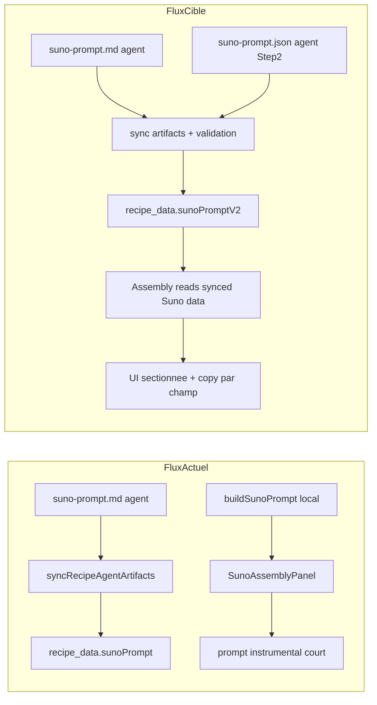

# Plan exhaustif en 2 étapes — Suno

## Analyse consolidée (cause racine)

Le problème observé vient d’un découplage entre le pipeline agent et le pipeline UI assembly.

Snippet clé côté assembly (prompt local court, non chanté) :

```ts
// modules/assembly/suno-prompt.ts
`Target duration: around ${durationSeconds} seconds, easy to trim for a short-form edit.`
"- no vocals, no lyrics, no spoken words, no voiceover"
```

Snippet clé côté sync agent (artefact bien persisté, mais non utilisé dans l’assembly UI) :

```ts
// modules/recipe-agent/use-cases/sync-recipe-agent-artifacts.ts
if (plan.sunoPrompt) {
  await mergeVideoProjectRecipeData(supabase, input.videoId, {
    sunoPrompt: plan.sunoPrompt,
    sunoPromptSyncedAt: new Date().toISOString(),
  });
}
```

Conséquence : l’app affiche un prompt « musique de fond 37s » au lieu d’exploiter le `suno-prompt.md` agent (style/exclude/title/auto-lyrics/short-version), ce qui dégrade fortement la qualité et casse le besoin business (version 2–3 minutes exploitable streaming).

## Cartographie du flux actuel et cible



---

## Étape 1 — Correctif produit rapide (sans changer le contrat agent)

Objectif : rendre immédiatement l’assembly exploitable avec une qualité proche de l’ancien repo `videos`, en utilisant la donnée déjà syncée (`suno-prompt.md`).

### 1) Brancher l’assembly sur la bonne source de vérité

- Remplacer la source locale `buildSunoPrompt(...)` dans [modules/assembly/ui/suno-assembly-panel.tsx](modules/assembly/ui/suno-assembly-panel.tsx) par lecture de `project.recipeData.sunoPrompt`.
- Garder [modules/assembly/suno-prompt.ts](modules/assembly/suno-prompt.ts) uniquement en fallback « secours » (et le neutraliser pour éviter la logique 37s/no-vocals si possible dans cette étape).
- Faire passer explicitement la donnée depuis [app/(dashboard)/videos/[videoId]/assembly/page.tsx](app/(dashboard)/videos/[videoId]/assembly/page.tsx) vers le panel.

### 2) Parser le markdown Suno en sections UI

- Ajouter un parseur robuste dans un nouveau module (ex: [modules/assembly/suno-prompt-format.ts](modules/assembly/suno-prompt-format.ts)) pour extraire :
  - `Style of Music`
  - `Exclude Styles`
  - `Title`
  - `Auto Lyrics Prompt`
  - `Short Version To Extract Later`
  - + bloc status/intent/settings si présent.
- Tolérance aux variations :
  - titres `##` manquants,
  - blocs ` ```text ` absents,
  - ordre des sections différent,
  - contenu brut non conforme -> fallback “Raw markdown”.

### 3) Refonte UX du panneau Suno (copy-ready)

- Remplacer la carte unique [modules/assembly/ui/suno-prompt-copy-card.tsx](modules/assembly/ui/suno-prompt-copy-card.tsx) par :
  - une carte par champ Suno,
  - un bouton copy par champ,
  - un bouton “Copy full Suno pack” (concat normalisé).
- Ajouter des instructions d’usage directement dans l’UI (ordre de collage dans Suno Custom Mode, points à vérifier).
- Afficher l’état de source :
  - “Agent Suno prompt detected” vs “Fallback prompt (needs revision)”.

### 4) Fallback produit explicite

- Si `recipeData.sunoPrompt` absent :
  - afficher un fallback minimal + warning clair,
  - CTA textuel vers révision agent (`suno_prompt_revision`) dans [modules/recipe-agent/ui/recipe-agent-panel.tsx](modules/recipe-agent/ui/recipe-agent-panel.tsx).
- Empêcher toute ambiguïté “prompt court = prompt final”.

### 5) Vérifications et tests Étape 1

- Ajouter tests unitaires parseur (nouveau fichier test dans `modules/assembly/...*.test.ts`).
- Cas à couvrir : template complet, template incomplet, markdown libre, champs vides.
- Vérification manuelle :
  - assembly affiche bien les 5 champs,
  - copy par champ fonctionne,
  - plus de mention de duration calée sur vidéo dans le flux principal.
- Validation globale : `npm run lint` + `npm test`.

### 6) Critères d’acceptation Étape 1

- Le prompt affiché en assembly provient de `recipe_data.sunoPrompt` quand présent.
- L’utilisateur peut copier séparément les 3 zones Suno critiques (style/exclude/auto lyrics) en 1 clic.
- Le flux 2–3 minutes est rappelé dans les instructions UI.
- Le prompt 37 secondes n’est plus le comportement principal.

---

## Étape 2 — Durcissement du contrat (format structuré versionné)

Objectif : supprimer l’ambiguïté markdown-only et stabiliser définitivement la qualité via un artefact JSON contractuel.

### 1) Introduire un artefact `suno-prompt.json` (source structurée)

- Étendre la liste d’artefacts dans [modules/recipe-agent/recipe-agent.constants.ts](modules/recipe-agent/recipe-agent.constants.ts) pour inclure `suno-prompt.json`.
- Définir un schéma Zod dédié dans [modules/recipe-agent/use-cases/sync-recipe-agent-artifacts.ts](modules/recipe-agent/use-cases/sync-recipe-agent-artifacts.ts) ou module séparé :
  - `schemaVersion`
  - `status` (recipeName, goal, model, targetDuration)
  - `fields` (styleOfMusic, excludeStyles, title, autoLyricsPrompt, shortVersionPlan)
  - `instructions` (voice, structure, workflowNotes)
  - `qualityChecks`.

### 2) Sync dual-format (JSON prioritaire, MD compatible)

- Dans [modules/recipe-agent/use-cases/sync-recipe-agent-artifacts.ts](modules/recipe-agent/use-cases/sync-recipe-agent-artifacts.ts) :
  - parser/valider `suno-prompt.json`,
  - merger dans `recipe_data.sunoPromptV2` (+ timestamp),
  - conserver `sunoPrompt` markdown pour rétro-compatibilité.
- Règle de priorité UI :
  1. `sunoPromptV2` (JSON)
  2. sinon `sunoPrompt` (markdown parsé)
  3. sinon fallback.

### 3) Aligner les instructions agent (app repo)

- Mettre à jour [modules/recipe-agent/recipe-agent.instructions.ts](modules/recipe-agent/recipe-agent.instructions.ts) pour exiger :
  - production de `suno-prompt.json` + `suno-prompt.md`,
  - durée longue 2–3 minutes,
  - séparation stricte style vs lyrics,
  - interdictions (imitation artiste/voix protégée, tuto recette lyrique).

### 4) Aligner le skill dans `recipe2video-agent-workspace` (repo dédié)

Dans le repo workspace agent, mettre à niveau :

- [C:/Users/yoann/Documents/GitHub/recipe2video-agent-workspace/.cursor/skills/suno-music-generation/SKILL.md](C:/Users/yoann/Documents/GitHub/recipe2video-agent-workspace/.cursor/skills/suno-music-generation/SKILL.md)
- Ajouter le template absent :
  - [C:/Users/yoann/Documents/GitHub/recipe2video-agent-workspace/.cursor/skills/suno-music-generation/references/suno-music-prompt-template.md](C:/Users/yoann/Documents/GitHub/recipe2video-agent-workspace/.cursor/skills/suno-music-generation/references/suno-music-prompt-template.md)

Contenu à imposer dans le skill :
- format de sortie contractuel JSON + markdown lisible,
- objectif “full song 2–3 min + extract 45–90s”,
- check <3000 chars sur `autoLyricsPrompt`,
- checklist qualité en fin de run.

### 5) UI Step 2 : consommation native JSON

- Adapter [modules/assembly/ui/suno-assembly-panel.tsx](modules/assembly/ui/suno-assembly-panel.tsx) et [modules/assembly/ui/suno-prompt-copy-card.tsx](modules/assembly/ui/suno-prompt-copy-card.tsx) pour mapper directement `sunoPromptV2.fields`.
- Ajouter badges “Structured v2” / “Legacy markdown”.
- Ajouter copy presets :
  - “Copy Suno Style Field”
  - “Copy Suno Exclude Field”
  - “Copy Suno Auto Lyrics Field”
  - “Copy Full Session Notes”.

### 6) Contrats/doc/tests Étape 2

- Mettre à jour le contrat artifact dans [docs/technical-contracts.md](docs/technical-contracts.md) (artefact JSON + priorités de sync).
- Ajouter tests sync :
  - JSON valide syncé,
  - JSON invalide rejeté,
  - fallback markdown toujours fonctionnel,
  - priorité JSON > markdown.
- Vérifier non-régression sur tests existants de sync artifacts.

### 7) Critères d’acceptation Étape 2

- Le pipeline Suno est déterministe (plus de dépendance à un parse markdown fragile uniquement).
- L’agent produit un rendu exploitable par l’UI sans retraitement manuel.
- La qualité de prompt redevient comparable au template `videos`.
- Compatibilité conservée avec les projets historiques déjà syncés en markdown.

---

## Plan d’exécution recommandé pour un agent cloud

### Séquence

- Run 1 (repo `recipe2video`) : implémenter Étape 1 complète + tests + lint/tests.
- Run 2 (repo `recipe2video`) : implémenter Étape 2 côté app (schema/sync/UI/docs/tests).
- Run 3 (repo `recipe2video-agent-workspace`) : aligner skill + template + exemples.
- Run 4 (validation bout-en-bout) : déclencher `suno_prompt_revision` sur une recette test puis vérifier affichage/copie dans `/assembly`.

### Risques et mitigations

- Risque parsing markdown hétérogène -> mitigation : fallback raw + badge legacy.
- Risque de divergence entre 2 repos -> mitigation : verrouiller contrat JSON versionné + docs.
- Risque de casser anciens projets -> mitigation : priorité JSON mais compat markdown inchangée.

### Definition of Done globale (2 étapes)

- L’assembly n’utilise plus un prompt “37s instrumental-only” comme source principale.
- L’utilisateur voit des champs Suno séparés, prêts à copier-coller.
- Le workflow prend en compte la stratégie “version longue 2–3 min + extrait short”.
- Le skill agent workspace contient template + règles cohérentes avec l’app.
- Tests unitaires + lint passent dans le repo application.