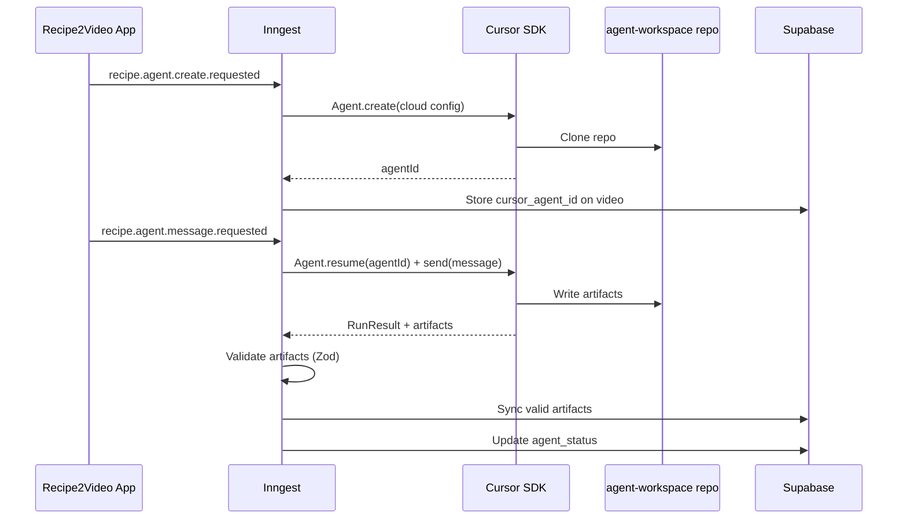

# Recipe2Video — Technical Contracts

### Purpose

This document defines the technical contracts for Recipe2Video. It is the source of truth for architecture, module boundaries, shared types, status values, database expectations, service interfaces, storage rules, auth requirements, workflow events, media handling, and integration boundaries.

Cursor agents must not invent alternate names, status values, data models, or API contracts. If a needed contract is missing, the agent must stop and ask for clarification in the GitHub issue.

---

## Core Architecture

Primary stack:

* Next.js App Router
* TypeScript
* Supabase Auth with Magic Link
* Supabase Postgres
* Supabase Storage
* pgvector for future feedback retrieval
* Inngest for durable workflow orchestration
* Runway API for media generation
* OpenAI API for GPT-5.5 High and embeddings
* Mux Pay-as-you-go Basic for playback, thumbnails, review, and streaming
* Remotion for assembly preview and export
* shadcn/ui for UI components
* dnd-kit for drag-and-drop ordering

Core architecture rules:

* Supabase DB stores metadata and workflow state.
* Supabase Storage stores original media files and durable masters.
* Mux stores playback assets and streaming derivatives only.
* Runway output URLs are temporary API outputs and must not be used as durable storage.
* `media_assets` is the central metadata layer for source uploads, reference images, Runway outputs, accepted clips, Suno audio, and final exports.

---

## Architecture Style

Recipe2Video uses a feature-first modular architecture with lightweight application and infrastructure boundaries.

This is intentionally not full Domain-Driven Design, full hexagonal architecture, or strict Clean Architecture. The project needs enough structure to prevent multi-agent chaos, but not enough ceremony to slow down a 10-15 hour hackathon build.

### Architectural Goals

* Keep external APIs isolated from UI components.
* Keep Supabase access inside repositories.
* Keep orchestration logic inside use cases and Inngest functions.
* Keep modules independently workable by Cursor agents.
* Avoid giant `lib/runway.ts`, `lib/supabase.ts`, or `utils.ts` files.
* Make it possible to move the project into a larger monorepo later if needed.

### Required Module Structure

```txt
app/
  (auth)/
  (dashboard)/
  api/
components/
  ui/
  layout/
modules/
  auth/
  videos/
  recipe-ingest/
  storyboard/
  references/
  generation/
  media-assets/
  feedback/
  costs/
  assembly/
  recipe-agent/
  demo/
shared/
  config/
  errors/
  utils/
  constants/
  logger/
supabase/
  migrations/
inngest/
  functions/
remotion/
  compositions/
fixtures/
  paris-brest/
.cursor/
  skills/
    use-runway-api/
    rw-api-reference/
    rw-integrate-video/
docs/

```

### Module Pattern

Each module may contain:

```txt
modules/<module>/
  <module>.types.ts
  <module>.constants.ts
  repositories/
  services/
  use-cases/
  ui/

```

Use this structure pragmatically. Do not create empty folders just for symmetry.

### Dependency Rules

* UI components must not call Runway, OpenAI, Mux, Supabase Storage, or Inngest directly.
* UI components can call server actions, API routes, hooks, or module-level use cases.
* Repositories handle Supabase database access.
* Services handle external integrations such as Runway, Mux, Supabase Storage, and OpenAI.
* Use cases orchestrate application logic across repositories and services.
* Inngest functions call use cases and should not duplicate business logic.
* Shared types must be imported from the appropriate module or `shared` when cross-module.

---

## Module Responsibilities

### `modules/auth`

Responsibilities:

* Magic Link login.
* Allowlist checks.
* Profile creation and retrieval.
* Auth guards for server actions and API routes.

Key files:

* `auth.types.ts`
* `auth.repository.ts`
* `auth.service.ts`
* `assert-allowlisted-user.ts`
* `ui/login-form.tsx`

### `modules/videos`

Responsibilities:

* Video project lifecycle.
* Dashboard data.
* Project status transitions.
* Project ownership and audit metadata.

Key files:

* `video.types.ts`
* `video-status.ts`
* `video.repository.ts`
* `create-video.ts`
* `get-video-dashboard-data.ts`

### `modules/recipe-ingest`

Responsibilities:

* URL, photo, and text recipe ingestion.
* Recipe normalization.
* Clarifying question generation.

Key files:

* `recipe.types.ts`
* `ingest-recipe.ts`
* `recipe-agent.ts`

### `modules/storyboard`

Responsibilities:

* Logical scene generation.
* Seedance segment compression.
* Storyboard approval checkpoint.
* Storyboard TTS pitch if implemented.

Key files:

* `storyboard.types.ts`
* `generate-storyboard.ts`
* `compress-to-seedance-segments.ts`
* `storyboard.repository.ts`

### `modules/references`

Responsibilities:

* Global and recipe-specific references.
* Reference planning.
* GPT-Image 2 reference generation.
* Runway reference uploads.
* Reference approval state.

Key files:

* `reference.types.ts`
* `plan-references.ts`
* `generate-reference-image.ts`
* `reference.repository.ts`

### `modules/generation`

Responsibilities:

* Runway task creation.
* Seedance generation requests.
* Task polling.
* Generation status.
* Generation variants.

Key files:

* `generation.types.ts`
* `generation-status.ts`
* `start-segment-generation.ts`
* `poll-runway-task.ts`
* `generation.repository.ts`

### `modules/media-assets`

Responsibilities:

* Supabase Storage persistence.
* Mux upload and playback metadata.
* Durable media records.
* Media retention policy.
* Downloading Runway outputs before URL expiry.

Key files:

* `media-asset.types.ts`
* `media-asset.repository.ts`
* `storage.service.ts`
* `mux.service.ts`
* `persist-runway-output.ts`
* `upload-media-asset-to-mux.ts`

### `modules/feedback`

Responsibilities:

* Natural-language correction handling.
* Prompt diff generation.
* Feedback logging.
* Embedding feedback for future RAG.

Key files:

* `feedback.types.ts`
* `generate-prompt-diff.ts`
* `feedback.repository.ts`
* `ui/prompt-diff-viewer.tsx`

### `modules/costs`

Responsibilities:

* Cost logging.
* Cost estimates before generation.
* Budget thresholds.
* Global pause state if implemented.

Key files:

* `cost.types.ts`
* `log-cost.ts`
* `estimate-generation-cost.ts`
* `cost.repository.ts`

### `modules/assembly`

Responsibilities:

* Suno audio upload linkage.
* Remotion props generation.
* Assembly preview.
* Final export persistence.

Key files:

* `assembly.types.ts`
* `build-remotion-props.ts`
* `assembly.repository.ts`
* `ui/assembly-preview.tsx`

### `modules/recipe-agent`

Responsibilities:

* Cursor SDK agent lifecycle (create, resume, send, dispose).
* Agent configuration resolution from environment variables.
* System prompt construction for recipe agents.
* Workspace path management.
* Artifact download, validation, and Supabase synchronization.
* Agent run tracking (`agent_runs` table).
* Agent artifact versioning (`agent_artifacts` table).
* Video agent session management (`cursor_agent_id`, `agent_status` on `videos`).

Key files:

* `recipe-agent.types.ts`
* `recipe-agent.config.ts`
* `recipe-agent.constants.ts`
* `recipe-agent.workspace.ts`
* `recipe-agent.instructions.ts`
* `services/cursor-agent.service.ts`
* `use-cases/orchestrate-recipe-agent.ts`
* `use-cases/sync-recipe-agent-artifacts.ts`
* `repositories/recipe-agent.repository.ts`
* `ui/recipe-agent-panel.tsx`

---

## Auth Contract

Auth method:

* Supabase Auth Magic Link.
* Only emails in `allowed_users` may access the application.
* No public self-serve signup.

Required tables:

```sql
allowed_users
  id uuid primary key default gen_random_uuid()
  email text unique not null
  role text not null default 'member'
  created_at timestamptz default now()

profiles
  id uuid primary key references auth.users(id)
  email text not null
  role text not null default 'member'
  created_at timestamptz default now()

```

Access rules:

* Dashboard routes require an authenticated Supabase user.
* Server routes that trigger costly work must verify allowlist status server-side.
* Costly actions include Runway generation, OpenAI calls, Mux upload, Remotion render, and any workflow that may trigger these.
* All costly actions should store `created_by` or `triggered_by` where possible.

Required helper functions:

```ts
assertAuthenticatedUser(): Promise<AuthUser>
assertAllowlistedUser(userId: string): Promise<AllowedUser>
getCurrentProfile(): Promise<Profile | null>

```

---

## Status Enums

Use these string values only unless this contract is updated.

### Video status

```ts
type VideoStatus =
  | 'draft'
  | 'recipe_ingested'
  | 'clarification_needed'
  | 'storyboard_ready'
  | 'storyboard_approved'
  | 'references_ready'
  | 'generating'
  | 'review'
  | 'assembling'
  | 'exported'
  | 'failed';

```

### Segment status

```ts
type SegmentStatus =
  | 'pending'
  | 'ready'
  | 'queued'
  | 'generating'
  | 'review'
  | 'accepted'
  | 'rejected'
  | 'failed'
  | 'blocked';

```

### Generation status

```ts
type GenerationStatus =
  | 'pending'
  | 'queued'
  | 'processing'
  | 'succeeded'
  | 'failed'
  | 'cancelled'
  | 'expired';

```

### Reference status

```ts
type ReferenceStatus =
  | 'planned'
  | 'generating'
  | 'generated'
  | 'approved'
  | 'rejected'
  | 'uploaded_to_runway'
  | 'failed';

```

### Media asset status

```ts
type MediaAssetStatus =
  | 'pending'
  | 'stored'
  | 'uploaded_to_mux'
  | 'failed'
  | 'deleted'
  | 'archived';

```

### Export status

```ts
type ExportStatus =
  | 'pending'
  | 'rendering'
  | 'completed'
  | 'failed';

```

---

## TypeScript Domain Types

### Video project

```ts
export interface VideoProject {
  id: string;
  title: string;
  slug: string;
  recipeUrl?: string | null;
  recipeData?: RecipeData | null;
  status: VideoStatus;
  storyboard?: Storyboard | null;
  selectedVideoModel: string;
  selectedImageModel: string;
  selectedTtsModel: string;
  selectedSfxModel: string;
  totalCostCredits: number;
  totalCostOpenai: number;
  createdBy?: string | null;
  createdAt: string;
  updatedAt: string;
}

```

### Logical scene

```ts
export interface LogicalScene {
  id: string;
  videoId: string;
  segmentId?: string | null;
  position: number;
  sceneType: 'detail' | 'context';
  arc: string;
  description: string;
  bg?: string | null;
  zoom?: string | null;
  durationTarget?: number | null;
  note?: string | null;
}

```

### Seedance segment

```ts
export interface SeedanceSegment {
  id: string;
  videoId: string;
  position: number;
  title: string;
  arc: string;
  logicalSceneIds: string\[\];
  description: string;
  prompt: string;
  promptInitial: string;
  references: SegmentReference\[\];
  durationTarget: number;
  status: SegmentStatus;
  selectedGenerationId?: string | null;
}

```

### Media asset

```ts
export interface MediaAsset {
  id: string;
  videoId?: string | null;
  segmentId?: string | null;
  generationId?: string | null;
  type:
    | 'recipe_source'
    | 'reference_image'
    | 'runway_output'
    | 'accepted_clip'
    | 'suno_audio'
    | 'final_export';
  provider: 'supabase' | 'mux' | 'runway' | 'suno' | 'manual';
  storageBucket?: string | null;
  storagePath?: string | null;
  muxAssetId?: string | null;
  muxPlaybackId?: string | null;
  runwayOutputUrl?: string | null;
  originalFilename?: string | null;
  mimeType?: string | null;
  fileSizeBytes?: number | null;
  durationSeconds?: number | null;
  width?: number | null;
  height?: number | null;
  status: MediaAssetStatus;
  metadata?: Record<string, unknown> | null;
  createdBy?: string | null;
  createdAt: string;
  updatedAt: string;
}

```

### Generation

```ts
export interface Generation {
  id: string;
  segmentId: string;
  mediaAssetId?: string | null;
  model: string;
  modelParams: Record<string, unknown>;
  runwayTaskId?: string | null;
  status: GenerationStatus;
  costCredits?: number | null;
  durationSeconds?: number | null;
  triggeredBy?: string | null;
  createdAt: string;
  completedAt?: string | null;
}

```

### Feedback

```ts
export interface SegmentFeedback {
  id: string;
  segmentId: string;
  generationId: string;
  message: string;
  promptBefore: string;
  promptAfter: string;
  diff: PromptDiff;
  applied: boolean;
  createdBy?: string | null;
  createdAt: string;
}

```

---

## Database Contract

Required main tables:

* `allowed_users`
* `profiles`
* `videos`
* `logical_scenes`
* `segments`
* `media_assets`
* `reference_assets`
* `generations`
* `scene_feedbacks`
* `cost_logs`
* `compositions`
* `agent_runs`
* `agent_artifacts`

Schema:

```sql
allowed_users
  id uuid primary key default gen_random_uuid()
  email text unique not null
  role text not null default 'member'
  created_at timestamptz default now()

profiles
  id uuid primary key references auth.users(id)
  email text not null
  role text not null default 'member'
  created_at timestamptz default now()

videos
  id uuid primary key
  title text
  slug text unique
  recipe_url text
  recipe_data jsonb
  status text
  storyboard jsonb
  seedance_segments jsonb
  selected_video_model text
  selected_image_model text
  selected_tts_model text
  selected_sfx_model text
  total_cost_credits integer
  total_cost_openai numeric
  created_by uuid references profiles(id)
  cursor_agent_id text nullable
  cursor_agent_runtime text nullable
  agent_workspace_path text nullable
  last_agent_run_id text nullable
  last_agent_sync_at timestamptz nullable
  agent_status text
  created_at timestamptz
  updated_at timestamptz

logical_scenes
  id uuid primary key
  video_id uuid references videos(id)
  segment_id uuid references segments(id)
  position integer
  scene_type text
  arc text
  description text
  bg text
  zoom text
  duration_target numeric
  note text

segments
  id uuid primary key
  video_id uuid references videos(id)
  position integer
  arc text
  title text
  logical_scene_ids jsonb
  description text
  prompt text
  prompt_initial text
  references jsonb
  duration_target numeric
  status text
  selected_generation_id uuid nullable
  created_by uuid references profiles(id) nullable
  created_at timestamptz
  updated_at timestamptz

media_assets
  id uuid primary key
  video_id uuid references videos(id) nullable
  segment_id uuid references segments(id) nullable
  generation_id uuid nullable
  type text
  provider text
  storage_bucket text nullable
  storage_path text nullable
  mux_asset_id text nullable
  mux_playback_id text nullable
  runway_output_url text nullable
  original_filename text nullable
  mime_type text nullable
  file_size_bytes bigint nullable
  duration_seconds numeric nullable
  width integer nullable
  height integer nullable
  status text
  metadata jsonb
  created_by uuid references profiles(id) nullable
  created_at timestamptz
  updated_at timestamptz

reference_assets
  id uuid primary key
  video_id uuid references videos(id) nullable
  media_asset_id uuid references media_assets(id) nullable
  type text
  canonical_name text
  source text
  runway_uri text nullable
  prompt text nullable
  status text
  created_at timestamptz

generations
  id uuid primary key
  segment_id uuid references segments(id)
  media_asset_id uuid references media_assets(id) nullable
  model text
  model_params jsonb
  runway_task_id text
  status text
  cost_credits integer
  duration_seconds numeric
  triggered_by uuid references profiles(id) nullable
  created_at timestamptz
  completed_at timestamptz

scene_feedbacks
  id uuid primary key
  segment_id uuid references segments(id)
  generation_id uuid references generations(id)
  message text
  prompt_before text
  prompt_after text
  diff jsonb
  applied boolean
  embedding vector(1536) nullable
  created_by uuid references profiles(id) nullable
  created_at timestamptz

cost_logs
  id uuid primary key
  video_id uuid references videos(id)
  segment_id uuid references segments(id) nullable
  provider text
  model text
  operation text
  credits_used integer nullable
  cost_dollars numeric nullable
  tokens_input integer nullable
  tokens_output integer nullable
  metadata jsonb
  created_by uuid references profiles(id) nullable
  created_at timestamptz

compositions
  id uuid primary key
  video_id uuid references videos(id)
  export_media_asset_id uuid references media_assets(id) nullable
  segment_order jsonb
  audio_media_asset_id uuid references media_assets(id) nullable
  audio_sync jsonb
  remotion_props jsonb
  export_status text
  created_by uuid references profiles(id) nullable
  created_at timestamptz
  updated_at timestamptz

agent_runs
  id uuid primary key
  video_id uuid references videos(id)
  cursor_agent_id text
  cursor_run_id text nullable
  stage text
  user_message text
  status text
  result_summary text nullable
  error text nullable
  created_by uuid references profiles(id) nullable
  started_at timestamptz
  completed_at timestamptz nullable
  created_at timestamptz
  updated_at timestamptz

agent_artifacts
  id uuid primary key
  video_id uuid references videos(id)
  artifact_name text
  artifact_path text
  content text
  content_hash text nullable
  validation_status text
  validation_errors jsonb
  created_at timestamptz
  updated_at timestamptz

```

Required indexes:

```sql
create index idx_videos_status on videos(status);
create index idx_videos_updated_at on videos(updated_at desc);
create index idx_segments_video_position on segments(video_id, position);
create index idx_media_assets_video on media_assets(video_id);
create index idx_media_assets_generation on media_assets(generation_id);
create index idx_generations_segment_status on generations(segment_id, status);
create index idx_cost_logs_video on cost_logs(video_id);
create index idx_feedback_segment_created on scene_feedbacks(segment_id, created_at desc);
create index idx_videos_cursor_agent_id on videos(cursor_agent_id);
create index idx_videos_agent_status on videos(agent_status);
create index idx_agent_runs_video_created on agent_runs(video_id, created_at desc);
create index idx_agent_runs_cursor_agent on agent_runs(cursor_agent_id);
create index idx_agent_artifacts_video on agent_artifacts(video_id);

```

Optional for RAG:

```sql
create index idx_feedback_embedding on scene_feedbacks using ivfflat (embedding vector_cosine_ops);

```

---

## Storage Contract

### Storage ownership

Supabase Storage is the durable source of truth for original media files.

Mux is a playback, thumbnail, and streaming layer.

Runway URLs are temporary API outputs.

### Buckets

Recommended buckets:

* `recipe-sources`
* `reference-images`
* `runway-outputs`
* `accepted-clips`
* `suno-audio`
* `final-exports`

### Storage paths

Recommended path patterns:

```txt
recipe-sources/{videoId}/{filename}
reference-images/{videoId}/{referenceId}.{ext}
runway-outputs/{videoId}/{segmentId}/{generationId}.mp4
accepted-clips/{videoId}/{segmentId}/{generationId}.mp4
suno-audio/{videoId}/{filename}
final-exports/{videoId}/{compositionId}.mp4

```

### Persistence workflow

When a Runway generation succeeds:

1. Retrieve the Runway output URL from the task.
2. Download the media file immediately.
3. Store the original file in Supabase Storage.
4. Create or update the related `media_assets` record.
5. Upload the same original file to Mux for playback.
6. Store Mux asset and playback IDs in `media_assets`.
7. Link the generation to the media asset through `generations.media_asset_id`.

When a final Remotion export succeeds:

1. Use original clip files from Supabase Storage.
2. Render final MP4.
3. Store final MP4 in Supabase Storage.
4. Create a `media_assets` record with type `final_export`.
5. Upload final MP4 to Mux for playback.
6. Link the composition to the export media asset.

### Retention policy

Hackathon P0:

* Keep all generated files.

Post-hackathon P1:

* Keep indefinitely:
  * accepted clips
  * final exports
  * approved reference images
  * uploaded Suno audio
  * recipe source files
* Delete or archive after 7-30 days:
  * rejected variants
  * failed attempts
  * unused generated references

### Storage limit risk

Supabase free-tier storage may be insufficient if many Seedance variants are generated. This should not change the architecture. If storage quota becomes an issue, upgrade Supabase or add Cloudflare R2 later.

---

## Mux Contract

Plan:

* Use Mux Pay-as-you-go, not the 10-video free plan.
* Use Basic on-demand video.
* Do not use Plus or Premium quality during the hackathon unless explicitly required.

Allowed during hackathon:

* Mux assets for playback.
* Mux Player.
* Mux thumbnails.
* Mux Data if available.

Avoid during hackathon:

* DRM.
* Custom domains.
* Live streaming.
* Systematic static MP4 renditions for every segment.
* Plus or Premium quality.

Rules:

* Mux playback IDs are not durable source files.
* If Mux data is lost, videos must be recoverable by re-uploading from Supabase Storage.
* Remotion should not render from Mux HLS playback streams.

Required helper functions:

```ts
uploadMediaAssetToMux(mediaAssetId: string): Promise<MuxAssetResult>
getMuxPlaybackUrl(playbackId: string): string

```

---

## Runway Contract

References:

* API documentation: https://docs.dev.runwayml.com/
* API reference: https://docs.dev.runwayml.com/api
* Models page: https://docs.dev.runwayml.com/guides/models/
* Pricing: https://docs.dev.runwayml.com/guides/pricing/
* Skills repository (public): https://github.com/runwayml/skills
* In-repo skills (authoritative for endpoints, request shapes, polling cadence, error handling): `.cursor/skills/use-runway-api/SKILL.md` and `.cursor/skills/rw-api-reference/SKILL.md`
* Node.js SDK: `@runwayml/sdk`
* Required environment variable: `RUNWAYML_API_SECRET`

Default models:

* Video: `seedance2` (announced by Runway as available via API; verify at hackathon kickoff because it is not yet listed on the public Models page; if Seedance 2 is web-app only at runtime, the workflow surfaces the failure and the user must explicitly switch to a manually wired alternative — there is no silent fallback)
* Image: `gpt_image_2` (Runway-exposed image model with References mode)
* TTS: `eleven_multilingual_v2`
* SFX: `eleven_text_to_sound_v2`

Default Seedance output:

* Ratio: `1080:1920` for 9:16 vertical 1080p output. The Runway Seedance guide lists 720p ratios plus “1080p equivalents”; `1080:1920` is the 1080p equivalent of `720:1280`.
* Cost estimate: 40 credits per second for Seedance 2 1080p generation. Treat this as the product-side estimate used before launch and in dashboards.

Rules:

* No silent fallback.
* Always show selected model before generation.
* Every Runway task ID must be stored.
* Polling should follow Runway guidance, approximately every 5 seconds.
* Every successful output must be persisted before the temporary URL expires.
* When the local Runway skills and this contract disagree, treat the skills as the source of truth for low-level API mechanics (endpoints, parameter names, response shapes) and this contract as the source of truth for product-side conventions (defaults, status enums, persistence flow).

Required helper functions:

```ts
createRunwayUpload(file: File | Blob): Promise<string>
startSeedanceGeneration(input: SeedanceGenerationInput): Promise<RunwayTask>
startReferenceImageGeneration(input: ReferenceImageInput): Promise<RunwayTask>
getRunwayTask(taskId: string): Promise<RunwayTaskStatus>
downloadRunwayOutput(outputUrl: string): Promise<Blob>

```

---

## OpenAI Contract

Use OpenAI directly for fallback or narrowly scoped planning utilities. The
primary creative planning path is the persistent Cursor recipe agent described
below.

* recipe reasoning
* storyboard generation
* Seedance segment planning
* prompt editing
* prompt diff generation
* feedback interpretation
* embeddings for learning memory

Default reasoning model:

* GPT-5.5 High

Rules:

* Log input tokens, output tokens, model, and estimated cost.
* Do not send API keys to the client.
* Feedback entries should be embedded when the RAG layer is implemented.

---

## Cursor Recipe Agent Contract

Recipe2Video uses the Cursor TypeScript SDK (`@cursor/sdk`) as the creative
planning runtime for persistent per-recipe agents. A recipe agent is not a code
contributor and must not open PRs for everyday recipe work. It is a creative
worker with a filesystem workspace whose artifacts are validated and
synchronized back into Supabase by the application.

Required environment variables:

```txt
CURSOR_API_KEY=
CURSOR_AGENT_REPO_URL=
CURSOR_AGENT_STARTING_REF=main
CURSOR_AGENT_MODEL=gpt-5.5
CURSOR_AGENT_MODEL_REASONING=high
CURSOR_AGENT_MODEL_CONTEXT=272k
CURSOR_AGENT_MODEL_FAST=false
CURSOR_AGENT_RUNTIME=cloud
CURSOR_AGENT_LOCAL_CWD=
RECIPE_AGENT_GITHUB_TOKEN=
```

Optional: `RECIPE_AGENT_GITHUB_TOKEN` (or `GITHUB_TOKEN` in dev) is a fine-grained PAT
with read access to `CURSOR_AGENT_REPO_URL`. The app uses the GitHub Contents API to
fetch `checkpoint-manifest.json` and large recipe artifacts at the exact commit SHA
after a run. Without it, artifact recovery falls back to the Cursor SDK payloads only.

For the `/library` admin page to auto-commit the regenerated
`.cursor/skills/asset-reference-system/SKILL.md` back into the agent workspace
repo, the same PAT also needs `Contents: Write` on that repository. Without write
access, the library mutation still persists to Supabase but the skill push is
reported as `skipped` and the agent will keep seeing the previous inventory until
an operator pushes the file manually.

Runtime rules:

* Default runtime is `cloud`.
* Cloud agents clone `CURSOR_AGENT_REPO_URL` at `CURSOR_AGENT_STARTING_REF`.
* Local runtime is reserved for development and uses `CURSOR_AGENT_LOCAL_CWD` or
  `process.cwd()`.
* `CURSOR_AGENT_MODEL_REASONING` is optional and maps to the Cursor SDK model
  reasoning/effort parameter for models that support it. For `gpt-5.5`, the
  app sends a complete Cursor model variant with `context`, `reasoning`, and
  `fast`; default context is `272k`, with `1m` reserved for exceptional long
  context jobs.
* `CURSOR_AGENT_MODEL_THINKING` remains accepted as a legacy alias for
  `CURSOR_AGENT_MODEL_REASONING`.
* The app stores the persistent Cursor `agentId` per video project in a later
  data-model issue.
* The app resumes the same agent for follow-up messages so recipe decisions are
  not regenerated from scratch.
* The agent does not receive Runway, Supabase, Mux, or Suno credentials for the
  planning flow.

Per-recipe workspace:

```txt
agent-recipes/{videoId}/
  recipe-analysis.json
  decisions.md
  logical-scenes.json
  seedance-segments.json
  reference-plan.json
  suno-prompt.md
  changelog.md
```

Agent boundaries:

* The agent may only write inside its `agent-recipes/{videoId}/` directory.
* The agent must not modify app source code, migrations, package files, shared
  rules, or docs.
* The agent must not run Git operations, create branches, create PRs, or commit.
* The agent must not call costly generation services.
* The app validates all artifacts before syncing them into canonical project
  tables.

### Two-Repository Architecture

Recipe2Video operates as two Git repositories:

| Repository | Purpose |
|---|---|
| `recipe2video` | Application repository — Next.js app, Inngest functions, Supabase migrations, Remotion compositions, and all production code. |
| `recipe2video-agent-workspace` | Agent workspace repository — cloned by cloud Cursor agents. Contains `.cursor/rules/`, `.cursor/skills/`, and an empty `agent-recipes/` directory tree. |

Cloud agents clone `recipe2video-agent-workspace` (set via `CURSOR_AGENT_REPO_URL`),
**not** the application repository. This keeps agents sandboxed away from
production code, migrations, and secrets. The workspace repo provides:

* Rules and skills that guide the agent's creative output.
* An empty `agent-recipes/` directory structure where each agent writes its
  per-video artifacts into `agent-recipes/{videoId}/`.
* No application source code, no `node_modules`, no credentials.

The application repository reads agent output by downloading artifacts through
the Cursor SDK (`agent.listArtifacts()` + `agent.downloadArtifact(path)`),
then validates and synchronizes them into Supabase.

### Agent Service Interface

The `CursorRecipeAgentService` interface in
`modules/recipe-agent/services/cursor-agent.service.ts` exposes two operations:

```ts
interface CursorRecipeAgentService {
  createRecipeAgent(input: CreateRecipeAgentInput): Promise<RecipeAgentSession>;
  sendMessage(input: SendRecipeAgentMessageInput): Promise<RecipeAgentRunResult>;
}
```

`createRecipeAgent` creates a new Cursor cloud agent backed by the workspace
repo, registers the `agentId` on the `videos` row, and returns a
`RecipeAgentSession`. Subsequent calls use `sendMessage`, which resumes the
existing agent with `Agent.resume(agentId)`, sends the user message, waits for
the run to finish, downloads artifacts from the agent workspace, and returns
a `RecipeAgentRunResult` including validated artifacts.

Both operations are wrapped by the orchestration layer
(`ensureRecipeAgent` + `sendRecipeAgentMessage` in
`modules/recipe-agent/use-cases/orchestrate-recipe-agent.ts`) which handles
agent-run tracking, session upsert, artifact sync, and status transitions.

### Artifact Validation and Synchronization

After each agent run the application downloads all files from
`agent-recipes/{videoId}/` and validates them:

**JSON artifacts — validated with Zod schemas:**

| Artifact | Zod Schema | Sync target |
|---|---|---|
| `recipe-analysis.json` | `RecipeAnalysisResultSchema` | `videos.recipe_data` (merge) |
| `logical-scenes.json` | `LogicalScenesEnvelopeSchema` | `logical_scenes` table (replace) |
| `seedance-segments.json` | `SeedanceSegmentsEnvelopeSchema` | `segments` table (replace) |
| `reference-plan.json` | `ReferencePlanSchema` | `reference_assets` table (replace) |

**Markdown artifacts — accepted as-is (no schema validation):**

| Artifact | Sync target |
|---|---|
| `decisions.md` | Stored in `agent_artifacts` only |
| `suno-prompt.md` | `videos.recipe_data.sunoPrompt` |
| `changelog.md` | Stored in `agent_artifacts` only |

Validation and sync rules:

* Every artifact (valid or not) is upserted into `agent_artifacts` with its
  `content_hash` (SHA-256), `validation_status` (`valid` | `invalid`), and
  any `validation_errors`.
* Invalid artifacts are **not** synced to canonical tables; they remain in
  `agent_artifacts` for debugging.
* Valid artifacts trigger a sync that replaces (not merges) the canonical table
  rows for that video, except `recipe_data` which is merged.
* Content hashes allow the application to detect whether an artifact changed
  between successive agent runs.

### Agent Orchestration Flow



---

## Inngest Contract

Required events:

```ts
'video.recipe.ingest.requested'
'video.storyboard.generate.requested'
'video.references.generate.requested'
'recipe.agent.create.requested'
'recipe.agent.message.requested'
'recipe.agent.sync.requested'
'segment.generation.requested'
'segment.generation.poll.requested'
'segment.output.persist.requested'
'segment.mux.upload.requested'
'segment.feedback.apply.requested'
'composition.render.requested'
'cost.log.requested'

```

Workflow rules:

* Do not run long-running workflows inside the Vercel request/response lifecycle.
* Persist state before and after each major step.
* Use retries for API failures where safe.
* Do not retry costly generations indefinitely.
* Respect configured Runway concurrency.

Recommended concurrency defaults:

* Start with 2 concurrent Seedance tasks.
* Increase only after confirming actual Runway tier limits.
* Add global pause and resume controls.

---

## Remotion Contract

Use Remotion for:

* final assembly preview
* segment ordering preview
* Suno audio alignment
* final MP4 export if feasible

Rules:

* Use Supabase Storage original files for final rendering.
* Do not render from Mux HLS playback streams.
* Store rendered final MP4 in Supabase Storage.
* Upload final MP4 to Mux after render for playback.

Fallbacks:

* P0: Remotion Player preview.
* P1: client-side export.
* Backup: Vercel Sandbox if client-side export is too slow or unstable.

---

## Cost Logging Contract

Every paid or potentially paid operation must write to `cost_logs`.

Required fields:

* provider
* model
* operation
* video_id
* segment_id if applicable
* credits_used if Runway
* cost_dollars if available or estimated
* tokens_input if OpenAI
* tokens_output if OpenAI
* metadata
* created_by

Cost operation safeguards:

* Show estimated credits before launching generation.
* Warn at 20% Runway credits remaining.
* Warn at 10% Runway credits remaining.
* Provide a global pause for new generation tasks.
* Start with conservative concurrency and increase only after tier validation.

---

## Prompting Contract

The product must preserve useful learning from the existing `ycoumesgau/videos` repo while removing legacy first-frame / last-frame production assumptions.

Keep:

* texture-first hook logic
* micro-arc opening
* ASMR food direction
* kitchen and character reference discipline
* fragile transformation detection
* complex geometry handling
* Seedance References mode rules
* Suno prompt generation logic

Do not keep as production path:

* first-frame / last-frame workflow
* Kling 2.5 Turbo Pro assumptions
* one-video-per-micro-scene generation model

Seedance prompt rules:

* English prompts.
* Explicit reference roles.
* Hard cuts.
* Mandatory timing.
* Total duration.
* No voice, no voiceover, no music in video generation prompts.
* Kitchen ASMR sounds only unless explicitly changed.
* Maximum 9 references per segment.

Prompt QA checklist before generation:

* References count is no more than 9.
* Global kitchen reference is present.
* Each reference has an explicit role.
* Prompt is under practical Runway prompt limits.
* Hard cuts are specified.
* Mandatory timing is specified.
* No speech, voiceover, or music is requested.
* Fragile food physics are explicitly handled when relevant.
* Non-standard geometry is described by what it is and what it is not.

---

## Fixtures Contract

Fixture purpose:

* Allow UI and workflow development without waiting for live Runway generations.
* Protect the hackathon demo from API latency or model availability issues.
* Provide a public-safe example project that demonstrates the real product flow.

Fixture source:

* Use the private `ycoumesgau/videos` repo as read-only source material.
* The Paris-Brest example should be the primary fixture source.

Public-safe extraction rules:

* Copy only minimal fixture data required for the public demo.
* Do not copy obsolete first-frame / last-frame / Kling production workflow artifacts.
* Do not copy secrets, credentials, private raw notes, or unnecessary large assets.
* Do not copy high-resolution mascot or brand assets unless explicitly approved.
* Human review is required before committing extracted fixture data to the public repo.

Recommended fixture structure:

```txt
fixtures/paris-brest/
  recipe.json
  logical-scenes.json
  seedance-segments.json
  references.json
  prompt-diff-example.json
  cost-logs.json
  suno-prompt.md
  README.md

public/demo/paris-brest/
  segment-01.mp4
  segment-02.mp4
  final-preview.mp4
  reference-raw.png
  reference-baked.png

```

---

## Non-Negotiable Technical Rules

* No costly action without authenticated allowlisted user.
* No public signup.
* No silent model fallback.
* No durable dependence on Runway output URLs.
* No durable dependence on Mux as the only storage layer.
* Supabase Storage stores original media masters.
* Mux is for playback, thumbnails, and streaming.
* `media_assets` is the canonical metadata layer for media.
* Remotion uses Supabase originals.
* Every async task has persisted status.
* Every API cost is logged.
* Shared status values must match this contract.